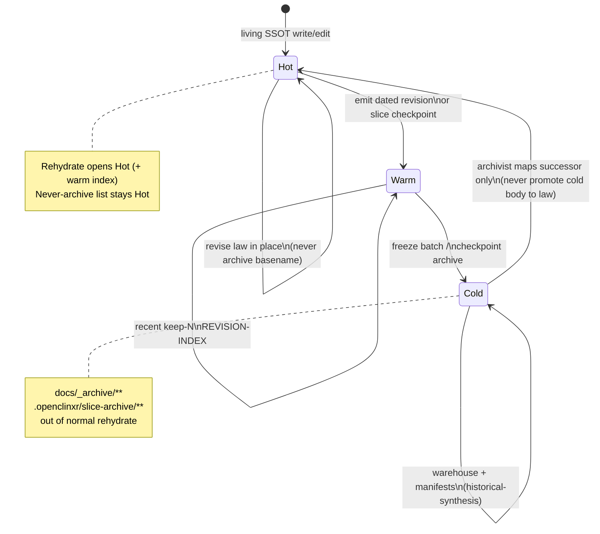
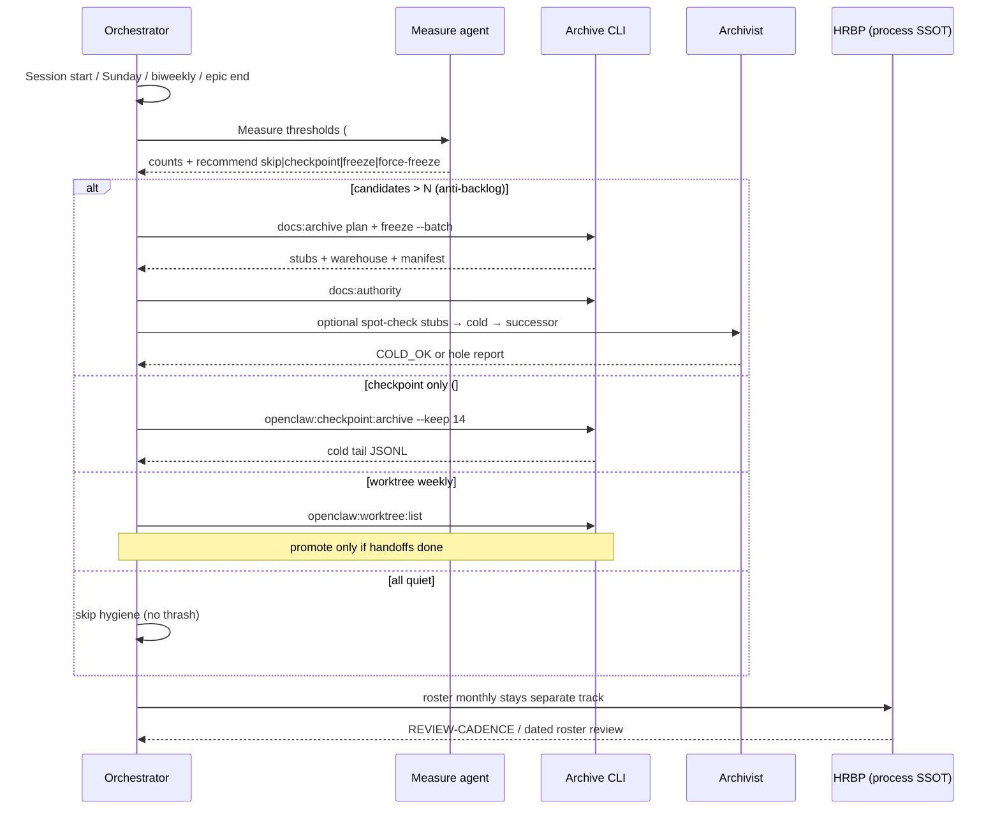

# Doc hygiene cadence (periodic warehouse + checkpoint cleanup)

**Temporal owner (when):** `pmo` · **Roster/process SSOT:** `hrbp` · **Cold verify (optional):** `archivist` · **Product dequeue gate:** orchestrator (respect force) · **Process holes:** openclaw-drift-police  
**Policy tier:** standard_execution · **BOD intent:** checkpointing/cleanup is **part of doing business** — unattended via SessionStart `--auto-run` + weekly script; not every task, not rare enough to backlog  
**Process SSOT (what to freeze):** [`DOC-WAREHOUSE.md`](./DOC-WAREHOUSE.md) · **Warm index:** [`REVISION-INDEX.md`](./REVISION-INDEX.md)  
**Related cadence:** [`REVIEW-CADENCE.md`](./REVIEW-CADENCE.md) (roster)

## Purpose

Define **when** to run warehouse freeze, checkpoint archive, roster review, and worktree list/gc hygiene — so living hot SSOT stays thin, agents rehydrate hot/warm only, and cold history remains findable via archivist + catalogs.

This is **agent-ops + coordination hygiene only** (not product clinical docs).

## Never per-task (hard)

Do **not** run freeze / checkpoint archive / full warehouse plan on every slice, every handoff, or every commit.

| Forbidden pattern | Why |
|-------------------|-----|
| Archive after each product slice | Thrash; stubs churn; interrupts Q1/Q4/Q5 build flow |
| Freeze one dated file at a time | Batch overhead > benefit; manifests fragment |
| Cold-read warehouse mid-routine rehydrate | Violates warehouse rehydrate rule |
| “Clean because we can” with no threshold | Turns hygiene into toil (anti-toil gate) |

Hygiene fires on **event + threshold** or **scheduled cadence** only (matrix below).

## Owners

| Role | Duty |
|------|------|
| **pmo** | **When** hygiene runs: own this cadence SSOT, thresholds, SessionStart auto-run design, weekly script, last-run state; prefer CLIs over banners; never product IC; never roster SoD |
| **orchestrator** | Respect force gate before product dequeue; do not invent ad-hoc freeze schedules; light banner awareness only |
| **hrbp** | Roster + dual-stack agent definition; REVIEW-CADENCE linkage; score process compliance on roster review — **not** temporal owner |
| **archivist** | Optional post-freeze spot-check: stub → warehouse body → successor SSOT; never rewrite hot law |
| **openclaw-drift-police** | Flag process holes: hot path bloated with dated bodies, agents treating cold as marching orders, per-task archive thrash, missing auto-run |

## Cadence defaults (recommend)

| Hygiene | Default trigger | Default keep / batch |
|---------|-----------------|----------------------|
| **Checkpoint archive** | `PROJECT_STATUS.md` `###` checkpoint blocks **> 20** **OR** weekly **Sunday** | `pnpm openclaw:checkpoint:archive -- --keep 14` |
| **Dated agent-ops freeze** | **≥ 5** new living-dated `docs/agent-ops/YYYY-MM-DD-*.md` bodies **OR** end of epic/wave **OR** **biweekly** | `pnpm docs:archive -- plan` → `freeze --batch <id>` then `pnpm docs:authority` |
| **docs:authority** | Always **after** a freeze batch (and after registry-touching MD adds) | `pnpm docs:authority` |
| **Worktree list / residual** | **Weekly** | `pnpm openclaw:worktree:list` (+ status); **promote leftovers only if handoffs done** — see [`WORKTREE-PROMOTE.md`](./WORKTREE-PROMOTE.md) |
| **Roster review** | **Monthly** (or major program replan) | Dated `docs/agent-ops/YYYY-MM-DD-roster-review.md` — see [`REVIEW-CADENCE.md`](./REVIEW-CADENCE.md) |

Tune keep/thresholds only via edit to **this** living file (not ad-hoc per session).

## Trigger matrix

| Event / threshold | Owner | CLI / action | Workflow phase (see below) |
|-------------------|-------|--------------|----------------------------|
| `###` blocks in `PROJECT_STATUS.md` **> 20** | pmo (CLI) | `pnpm openclaw:checkpoint:archive -- --keep 14` | measure → archive |
| Weekly Sunday (calendar / durable scheduler) | pmo | Same checkpoint archive if keep tail fat | measure → archive |
| **≥ 5** new dated agent-ops revision files (bodies, not stubs) | pmo (+ hrbp if epic close) | `pnpm docs:archive -- plan` → `freeze --batch <id>` | measure → freeze → verify |
| End of epic / multi-wave program (e.g. context-opt complete) | pmo + hrbp | Freeze epic-dated set; update `REVISION-INDEX.md` | plan → freeze → verify |
| Biweekly (if freeze threshold not hit) | pmo | `pnpm docs:archive -- status`; freeze only if cold candidates ≥ 3 | measure (skip freeze if quiet) |
| After any freeze | pmo | `pnpm docs:authority` | verify |
| Cold candidates **> N** (default **N = 8**) at session start | **pmo hooks auto-run** | **Force freeze** without operator (`session-start --auto-run`) | measure → freeze (unattended) |
| Weekly worktree residual | pmo | `pnpm openclaw:worktree:list` (+ promote only when handoffs complete) | measure → (optional promote) |
| Monthly roster | hrbp | Full dual-stack roster scan → dated review MD | (roster track; not warehouse freeze) |
| Agents open `docs/_archive/**` as law | drift-police + hrbp | Correct prompts; restate rehydrate rule | process hole |
| Per-task archive attempted | drift-police | Reject; point here | process hole |

### Anti-backlog (session start) — **WIRED**

| Check | Default | Force hygiene? |
|-------|---------|----------------|
| Live dated revision bodies (non-stub) | **> 8** | Yes |
| `###` checkpoint blocks | **> 20** | Checkpoint (and force if stale) |
| Days since last successful hygiene | **≥ 14** (few weeks / computer off) | Yes — full catch-up |
| No `last-run` state yet | first quiet session heartbeats | No force until backlog or 14d |

If force:

1. **Do not** dequeue product slice first (orchestrator gate).
2. **Unattended:** SessionStart hook already runs `pnpm docs:hygiene:session-start -- --auto-run` → measure → checkpoint/freeze/authority/worktree with **no operator step**.
3. Manual fallback only if auto-run failed: `pnpm docs:hygiene:run`.
4. Then resume normal `openclaw:run-next`.

**SessionStart hook:** `.grok/hooks/session-start-docs-hygiene.json` runs `pnpm docs:hygiene:session-start -- --auto-run` (timeout 300s). On force: **executes hygiene in background of session start** — zero operator involvement. Exit 0 when auto-run succeeds; exit 2 only if force and auto-run failed (or `--auto-run` omitted). Quiet sessions heartbeat `last-run` only.

**State file:** `.openclinxr/docs-hygiene/last-run.json` (updated after successful auto-run / `docs:hygiene:run` / quiet heartbeat).

**Weekly Sunday:** `tooling/scripts/docs-hygiene-weekly.sh` or durable scheduler fires `pnpm docs:hygiene:run` — see Scheduler section below. Owner: **pmo**.

## CLI cheat sheet

```bash
# SessionStart (hooks call this) — auto-runs force path unattended
pnpm docs:hygiene:session-start -- --auto-run

# Measure only (JSON)
pnpm docs:hygiene:measure -- --json

# Manual / weekly / end-of-epic execute
pnpm docs:hygiene:run
pnpm docs:hygiene:run -- --dry-run

# Manual warehouse ops
pnpm docs:archive -- status
pnpm docs:archive -- plan
pnpm docs:archive -- freeze --batch <batch-id>
pnpm docs:authority
pnpm openclaw:checkpoint:archive -- --keep 14
pnpm openclaw:worktree:list
```

## Grok workflow role (multi-agent)

Hygiene is a **short multi-agent plan → measure → freeze/archive → verify** loop. Prefer durable **scheduler** (weekly Sunday) + **SessionStart** catch-up; optional Grok workflow (Rhai `agent()` / `parallel()` / `phase`) when the CEO authors `.grok/workflows/docs-hygiene.rhai` via create-workflow.

**Do not invent broken Rhai here.** Phases + prompts below are the contract for a future workflow file.

### Phases

| Phase | Actor | Goal | Done when |
|-------|-------|------|-----------|
| **1. Plan** | orchestrator (or flash scout) | Confirm thresholds; choose freeze batch id if any; skip if all quiet | Decision: skip \| checkpoint-only \| freeze+checkpoint \| force-freeze |
| **2. Measure** | measure agent (explore / flash) | Count `###` blocks; list dated agent-ops bodies vs stubs; cold candidate count; worktree list summary | Numbers in handoff-style bullets; no edits |
| **3. Freeze / archive** | orchestrator hygiene shell | Run allowed CLIs only when thresholds met | Exit 0; REVISION-INDEX updated if freeze; keep-N applied |
| **4. Verify** | orchestrator + optional **archivist** | `docs:authority`; stub→warehouse→successor spot-check (1–3 files) | Authority green; archivist confirms cold not promoted to law |
| **5. Record** | orchestrator | One-line checkpoint or operator note if force-freeze delayed product | Hot ledger notes hygiene ran; no multi-KB ceremony |

### Agent prompts (copy into workflow / spawn later)

**Measure (explore, read-only):**

```text
Role: docs-hygiene measure (read-only).
Count PROJECT_STATUS ### checkpoint blocks; list docs/agent-ops/YYYY-MM-DD-*.md that are full bodies (not archive stubs); run conceptual plan against DOC-WAREHOUSE never-archive list.
Return: counts only + recommended action from DOC-HYGIENE-CADENCE trigger matrix. No edits.
```

**Archive execute (orchestrator shell only):**

```text
If measure recommends checkpoint: pnpm openclaw:checkpoint:archive -- --keep 14
If measure recommends freeze: pnpm docs:archive -- plan then freeze --batch <id>; then pnpm docs:authority
Never archive Hot living SSOT (DOC-WAREHOUSE never-archive list). Never per-task.
```

**Archivist spot-check (optional, read-only):**

```text
Role: archivist. Pick 1–3 files from latest freeze batch. Verify stub points to warehouse body + successor living SSOT. Report VERDICT: COLD_OK | STUB_BROKEN | SUCCESSOR_MISSING. Do not rewrite hot law.
```

### Scheduler default (recommend)

| Schedule | Fire |
|----------|------|
| **Every SessionStart** | `pnpm docs:hygiene:session-start` (banner; exit 2 if force) |
| **≥ 14 days since last hygiene** (computer off) | Same as force — CEO runs `pnpm docs:hygiene:run` before product work |
| Weekly Sunday | `pnpm docs:hygiene:run` (checkpoint + freeze if needed + worktree list) |
| Biweekly | Full measure + freeze if candidates ≥ 3 |
| Session start (candidates > N) | Force freeze path via same CLI |

**Durable scheduler (CEO installs once per long-running machine):**

```text
# Conceptual — use Grok scheduler_create or cron:
# Sunday 18:00 local: cd <repo> && pnpm docs:hygiene:run
# Interval alternative: every 7d when machine is on
```

When the machine was off for weeks, **SessionStart** still fires on next CEO session and surfaces catch-up via `days_since_hygiene ≥ 14`.

---

## Mermaid — hot / warm / cold lifecycle



## Mermaid — periodic hygiene workflow



## Never-archive reminder (hygiene must not freeze)

Living files in [`DOC-WAREHOUSE.md`](./DOC-WAREHOUSE.md) Hot list — including **this file** `DOC-HYGIENE-CADENCE.md` — stay hot. Freeze **dated** revision records and checkpoint tails only.

## Score on roster review (hrbp)

| Check | Fail signal |
|-------|-------------|
| Cadence known | Agents freeze per-task or never freeze until hot path unreadable |
| Anti-backlog | candidates > N ignored across sessions |
| Rehydrate | Agents open warehouse as marching orders |
| Owners | Product roles running freeze without orchestrator hygiene |

Severity: **major** if cold backlog ignored or per-task thrash; **critical** only if living Hot SSOT was archived/stubbed.

## Related

- [`DOC-WAREHOUSE.md`](./DOC-WAREHOUSE.md) — tiers, freeze process, never-archive  
- [`REVISION-INDEX.md`](./REVISION-INDEX.md) — frozen batches  
- [`REVIEW-CADENCE.md`](./REVIEW-CADENCE.md) — roster monthly  
- [`WORKTREE-PROMOTE.md`](./WORKTREE-PROMOTE.md) — promote loop  
- [`PATH-SCOPE.md`](./PATH-SCOPE.md) — archivist path-scope  
- `agents/coordinator/archivist/` — cold retrieval  
- `pnpm docs:archive` · `pnpm openclaw:checkpoint:archive` · `pnpm openclaw:worktree:list`
