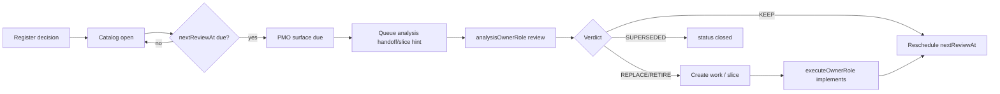

# Temporal decisions (periodic revisit workflow)

**When (cadence):** `pmo` · **Catalog SSOT:** [`temporal-decisions-catalog.json`](./temporal-decisions-catalog.json) · **CLI:** `pnpm temporal:review`  
**Related:** [`DOC-HYGIENE-CADENCE.md`](./DOC-HYGIENE-CADENCE.md) (warehouse) · [`CAPABILITY-EVOLUTION.md`](./CAPABILITY-EVOLUTION.md) (tool/model escalate) · [`REVIEW-CADENCE.md`](./REVIEW-CADENCE.md) (roster)

## Why

Many repo choices are **time-bound workarounds** (tool gaps, model limits, stack pins, evidence of absence). They go stale. Forgetting them leaves **permanent second systems** (e.g. ccusage dual-accounting because Grok once lacked subagent token emission).

This workflow **catalogs** those decisions, **surfaces them when due**, and **queues analysis** that may spawn product/harness work — without making every review an ad-hoc chat memory.

## SoD (not all PMO work)

| Duty | Owner |
|------|--------|
| Catalog integrity, due dates, SessionStart/hygiene surface, queue stubs | **pmo** |
| Analysis / research of a due item | **analysisOwnerRole** on the item (e.g. architect, openclaw-drift-police, hrbp) |
| Implementation of resulting work | **executeOwnerRole** or product dequeue via orchestrator |
| Capability/MCP/model definition changes | **hrbp** (+ CAPABILITY-EVOLUTION) |
| Product IC | never pmo |

PMO **remembers and schedules**. Specialists **judge**. Implementers **change code**.

## Lifecycle



### Status values

| Status | Meaning |
|--------|---------|
| `open` | Active decision; not yet due |
| `due` | Past `nextReviewAt` (CLI may recompute) |
| `in_review` | Analysis assigned / in flight |
| `keep` | Review concluded: still valid; rescheduled |
| `replace` | Review concluded: change required; work queued |
| `retire` | Review concluded: remove workaround |
| `closed` | Terminal (superseded or retired completed) |

### Verdict → work

- **KEEP** — bump `nextReviewAt` by `cadenceDays`; stay open  
- **REPLACE** / **RETIRE** — set status; write queue note; orchestrator may init a slice or backlog row  
- Analysis may file capability-request under `capability-requests/` if model/MCP gap

## CLI

```bash
pnpm temporal:review -- list
pnpm temporal:review -- due                 # items past nextReviewAt
pnpm temporal:review -- measure             # JSON for hooks/banners
pnpm temporal:review -- register --id <id> --title "..." --cadence-days 90 ...
pnpm temporal:review -- mark --id <id> --status keep|replace|retire|in_review|closed
pnpm temporal:review -- queue                # write due items to queue file for orchestrator
pnpm temporal:review -- reschedule --id <id> --days 90
```

State (local, optional): `.openclinxr/temporal-review/last-measure.json`  
Queue artifact: `docs/agent-ops/temporal-review-queue.md` (warm; PMO regenerates)

## Cadence defaults

| Class | Default cadenceDays | Examples |
|-------|---------------------|----------|
| Tooling workaround | 7–90 | ccusage vs native Grok token emit (weekly for Grok/Turbo) |
| Task cost rates | 7–30 | `model-pricing.ts` blended rates for rollups |
| Model capability | 45–90 | DeepSeek vision; multimodal routing |
| Stack version pin | 90–180 | IWSDK, Turbo, vitest major |
| Process/OS experiment | 90 | product-under-os metrics dual-path |
| Security/audit pin | 30–60 | dependency overrides after audit |

Tune per item; never invent silent permanent exceptions.

## SessionStart / hygiene integration

`pnpm docs:hygiene:session-start` (and PMO measure) **includes a line** when temporal items are due — does **not** force freeze by itself. Operator/orchestrator should:

1. Run `pnpm temporal:review -- due`  
2. Optionally `pnpm temporal:review -- queue`  
3. Dequeue analysis (spawn analysisOwnerRole) **or** park after product force-hygiene  

Anti-toil: do not open every due item every session — **batch** (default: top N=3 by priority).

## Register when

Register a temporal decision when you:

- Accept a **workaround** because a tool/model lacks a feature  
- Pin a **version** or **policy** “until X is proven”  
- Choose **dual systems** (two ways to measure the same thing)  
- Defer a **stack upgrade** after a spike  

Do **not** catalog every MADR — only decisions with a **revisit trigger**.

## Never-archive

`TEMPORAL-DECISIONS.md` and `temporal-decisions-catalog.json` are **living** — never freeze/stub (see DOC-WAREHOUSE never-archive list).
