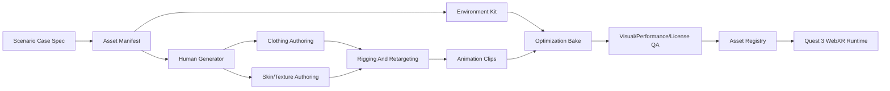

# Automated Asset Generation Pipeline

Date: 2026-05-03
Status: Development-team guidance with first registry contract implemented

## Goal

Create station-specific 3D characters, clothing, room environments, props, equipment, speech/audio, gesture clips, and optimized runtime bundles in a repeatable way. The pipeline should maximize open and permissive technology while isolating copyleft or commercial tools behind non-runtime boundaries.

## Pipeline Overview



## Asset Manifest

Every station should produce an `asset_manifest` before any modeling work starts.

First implementation status:

- `packages/openclinxr/asset-registry` implements `AssetManifest`, `InMemoryAssetRegistry`, `evaluateAssetManifest`, `createEdChestPainPlaceholderManifests`, and `createScenarioPlaceholderManifests`.
- The first registry gate blocks assets with `copyleft_blocked`, `unknown`, or review-required license posture.
- The first registry gate blocks assets that have not reached `qa_ready`.
- The first registry gate blocks Quest 3 assets over initial triangle, texture-memory, or draw-call budgets.
- The first registry gate also sums required station assets and blocks aggregate Quest 3 station bundles over 180,000 visible triangles, 512 MB texture memory, or 120 draw calls.
- ED chest pain placeholder manifests now cover the patient character, nurse character, and ED exam bay environment.
- The generic placeholder-manifest factory can materialize dev-ready, production-blocked manifests from every seed-bank scenario `assetNeeds` entry, allowing all 12 stations to be checked against Quest budgets before real asset generation.
- These placeholders are runtime scaffolding only; they are not production clinical realism assets.

```json
{
  "scenario_id": "ed_chest_pain_priority_v1",
  "asset_manifest_version": 1,
  "target_device": "quest_3_webxr",
  "license_policy": "permissive-runtime-only",
  "characters": [
    {
      "actor_id": "patient_robert_hayes_v1",
      "role": "patient",
      "age": 54,
      "body": { "height_cm": 178, "weight_kg": 92, "build": "stocky", "mobility": "limited_by_pain" },
      "skin": { "tone": "medium", "features": ["sweat", "mild_flushing", "stubble"] },
      "hair": { "style": "short", "color": "salt_and_pepper" },
      "clothing": ["hospital_gown", "non_slip_socks"],
      "emotion_profile": ["anxious", "pain", "guarded"],
      "animation_set": ["idle_pain", "clutch_chest", "short_breath", "look_to_family", "answer_question"],
      "voice_profile": "middle_aged_male_anxious_en_us"
    }
  ],
  "environment": {
    "environment_id": "ed_bay_v1",
    "room_kit": ["stretcher", "monitor", "iv_pole", "ecg_cart", "privacy_curtain", "wall_oxygen"],
    "lighting": "baked_fluorescent_ed",
    "audio_bed": ["ed_ambient_low", "distant_monitor_beep"]
  },
  "budgets": {
    "max_station_bundle_mb": 80,
    "max_visible_triangles": 180000,
    "max_draw_calls": 120,
    "max_texture_memory_mb": 512,
    "target_fps": 72,
    "stretch_fps": 90
  }
}
```

## Character Generation

Primary path:

1. Generate base body with Anny.
2. Export neutral mesh and shape metadata.
3. Map to the OpenClinXR canonical skeleton.
4. Apply age/body/mobility constraints from the asset manifest.
5. Export a neutral GLB and a source archive.

Fallback path:

1. Use MakeHuman/MPFB/MakeHuman CC0 assets where output licensing is verified.
2. Keep AGPL/GPL authoring code outside OpenClinXR.
3. Do not embed or distribute MakeHuman source code as part of the runtime.

Minimum character variants for the first 12-case bank:

- Adult male.
- Adult female.
- Older adult.
- Adolescent.
- Child.
- Pregnant or postpartum adult.
- Nurse.
- Physician/consultant.
- Family/caregiver.
- Interpreter/social worker.

## Skin And Texture Authoring

Preferred runtime-safe texture sources:

- Hand-authored Blender/PBR textures.
- CC0/CC-BY texture libraries with provenance.
- Anny/MakeHuman-compatible CC0 materials.

Optional isolated path:

- StableGen can be evaluated for offline texture generation only because it is GPL-3.0.
- Generated texture output must receive license review and provenance capture before entering the asset registry.
- StableGen code must not be embedded into OpenClinXR runtime, backend, or distributed tools.

Texture rules:

- Use KTX2/Basis compression for runtime textures.
- Use 2K max for hero characters in Quest 3 runtime.
- Use 1K for secondary actors.
- Use 512 or atlas tiles for props and background equipment.
- Add mipmaps for all runtime textures.
- Avoid transparent layered hair and complex alpha materials unless performance tested.

## Clothing Pipeline

Inputs:

- Role-specific clothing requirements from case specs.
- Institutional style guide for scrubs, coats, gowns, PPE, clinic clothing, and family clothing.
- Per-asset license metadata.

Recommended tools:

- MakeClothes for MakeHuman-compatible clothing where MIT plugin licensing and asset output are acceptable.
- Blender native cloth modeling for custom clothing.
- CC0/CC-BY clothing meshes only after provenance review.

Runtime rules:

- Bake cloth simulation into static meshes or clips.
- Avoid live cloth physics on Quest 3.
- Combine material slots aggressively.
- Produce LOD variants and collider simplifications.

## Rigging And Animation

Baseline:

- Use a canonical OpenClinXR humanoid skeleton.
- Retarget all body clips to this skeleton.
- Use blendshape targets for facial expressions and visemes.
- Store rig metadata in the asset registry.

Permissive tools:

- Mesh2Motion for browser-based rigging/animation export where it passes QA.
- Blender Rigify for authoring when output licensing is clean.

Commercial adapters:

- NVIDIA ACE/Audio2Face can be evaluated for facial animation and emotion-driven lip sync.
- Treat it as an optional adapter with vendor terms, not an open-source baseline.

Animation clip groups:

- Idle: neutral, anxious, pain, fatigued, guarded, confused, angry.
- Conversation: listen, answer, hesitate, look away, look to family, look to nurse.
- Clinical reaction: cough, shortness of breath, abdominal guarding, flinch, dizziness, tremor, crying.
- Team action: nurse enters, nurse points to monitor, consultant asks for summary, family interrupts.
- Environment: monitor alarm, door curtain movement, phone ringing, staff passing outside.

Runtime animation rules:

- Prefer pre-baked clips and lightweight blend trees.
- Drive only small emotion/gaze/viseme deltas at runtime.
- Do not generate body motion on the headset.
- Use audio-driven facial motion only after deterministic station performance passes.

## Environment And Equipment Kits

Each environment should be a kit of optimized reusable modules:

- ED bay.
- Inpatient ward room.
- Outpatient clinic room.
- Pediatrics exam room.
- ICU/rapid response bay.
- Telehealth station.
- Hallway handoff.
- Waiting room.

Clinical equipment library:

- Stretcher/bed with rails.
- Wall monitor.
- ECG machine and leads.
- IV pole and pumps.
- Oxygen cannula/mask.
- Stethoscope.
- Blood pressure cuff.
- Pulse oximeter.
- Thermometer.
- Crash cart.
- Medication cart.
- Laptop/EHR terminal.
- Hand sanitizer and PPE.
- Whiteboard.
- Exam stool and chairs.
- Curtains/doors/privacy divider.

All equipment must include:

- Asset ID and version.
- License.
- Triangle count.
- Material count.
- Collider type.
- Interaction zones.
- Clinical affordances.
- Whether it can appear in learner trace events.

## Optimization Bake

Use a deterministic build script around Blender and a permissive GLB conversion/optimization CLI. The current pinned local CLI is `gltf-pipeline` 4.3.1 (Apache-2.0). Treat `gltf-transform` as an optional external workstation tool until its current CLI dependency path satisfies the copyleft policy.

Suggested build phases:

```text
1. validate-manifest
2. import-source-assets
3. normalize-scale-and-origins
4. assign-canonical-skeleton
5. bake-materials-and-lightmaps
6. generate-lod0-lod1-lod2
7. simplify-colliders
8. atlas-materials
9. compress-textures-ktx2
10. compress-geometry-meshopt
11. prune-unused-nodes
12. package-station-bundle
13. generate-qa-report
```

Example optimization command shape:

```bash
gltf-pipeline -i input.gltf -o output.glb -b
```

The first executable local smoke is:

```bash
pnpm asset:gltf:smoke -- --output docs/openclinxr/gltf-pipeline-smoke-2026-05-03.json
```

Do not treat a successful conversion command as proof of runtime readiness. Runtime readiness requires headset FPS, memory, interaction, visual checks, and later compression/texture-bake evidence.

## QA Gates

Every station bundle must pass:

- License manifest complete.
- Source provenance complete.
- GLB loads in desktop browser.
- GLB loads on Quest 3 browser.
- Scene enters immersive WebXR mode.
- Minimum 72 FPS in station idle.
- No frame spikes above threshold during actor response.
- No missing textures.
- No oversized textures.
- No more than allowed draw calls.
- Colliders match visible objects.
- Text panels remain readable.
- Actor mouth/gesture sync acceptable in deterministic clips.
- Replay can reconstruct actor positions and environment state.

## Asset Registry Additions

Add these fields to `assets` or a dedicated `asset_versions` collection:

```json
{
  "asset_id": "patient_robert_hayes_v1_lod0",
  "asset_family": "patient_robert_hayes",
  "asset_type": "character",
  "source_tools": ["anny", "blender", "mesh2motion", "gltf-pipeline"],
  "source_license_ids": ["apache-2.0", "cc0", "mit"],
  "forbidden_runtime_dependencies": ["stablegen-gpl3"],
  "gltf_url": "https://cdn.openclinxr.local/assets/patient_robert_hayes_v1_lod0.glb",
  "lods": [
    { "level": 0, "triangles": 42000, "distance_m": 0 },
    { "level": 1, "triangles": 18000, "distance_m": 3 },
    { "level": 2, "triangles": 6000, "distance_m": 7 }
  ],
  "textures": [
    { "id": "patient_robert_skin_2k", "format": "ktx2", "max_size": 2048 }
  ],
  "animation_clips": ["idle_pain", "clutch_chest", "answer_question"],
  "qa_status": "passed",
  "qa_report_id": "asset_qa_patient_robert_hayes_v1",
  "created_at": "ISODate"
}
```

## Runtime Loading Strategy

Station runtime should load in tiers:

1. Essential environment shell, lighting, and colliders.
2. Hero patient and primary nurse/family actors.
3. Equipment needed for traceable interactions.
4. Audio beds and animation clips.
5. Secondary props.

Quest 3 should never block the station on nonessential props. If an asset misses a performance or network deadline, load a simplified placeholder and record an asset degradation event.

## M4 Max Local Workstation Mode

The M4 Max MacBook Pro with 64 GB RAM should be treated as:

- Asset generation workstation.
- Local LLM/ASR/TTS experimentation host.
- End-to-end demo server for one learner.
- Blender/ComfyUI/NVIDIA or alternative animation experimentation machine.

It should not define production infrastructure. Production should rely on pre-baked assets, managed storage/CDN, external model APIs or separately scaled inference, and lightweight orchestration.

## Sources

- `src-anny-github-2026`
- `src-makehuman-community-license-2026`
- `src-makehuman-makeclothes-github-2026`
- `src-stablegen-github-2026`
- `src-mesh2motion-2026`
- `src-nvidia-ace-audio2face-2026`
- `src-mdn-webxr-performance-2026`
- `src-npm-stack-metadata-2026-05-03`
