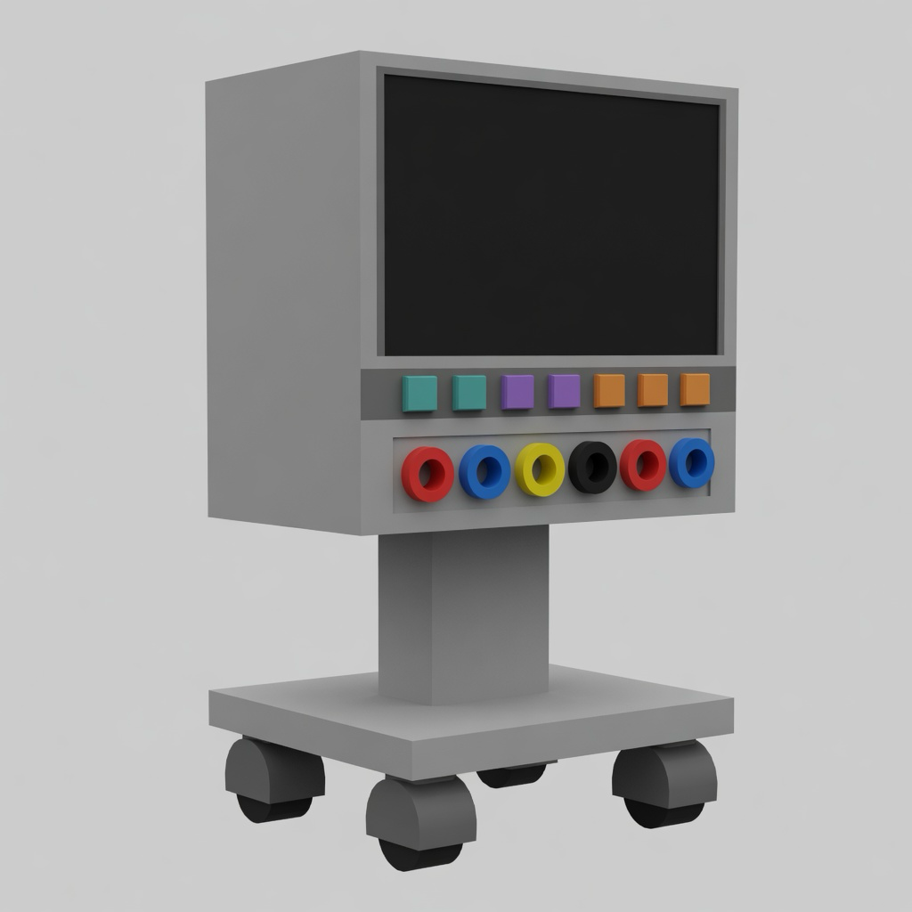
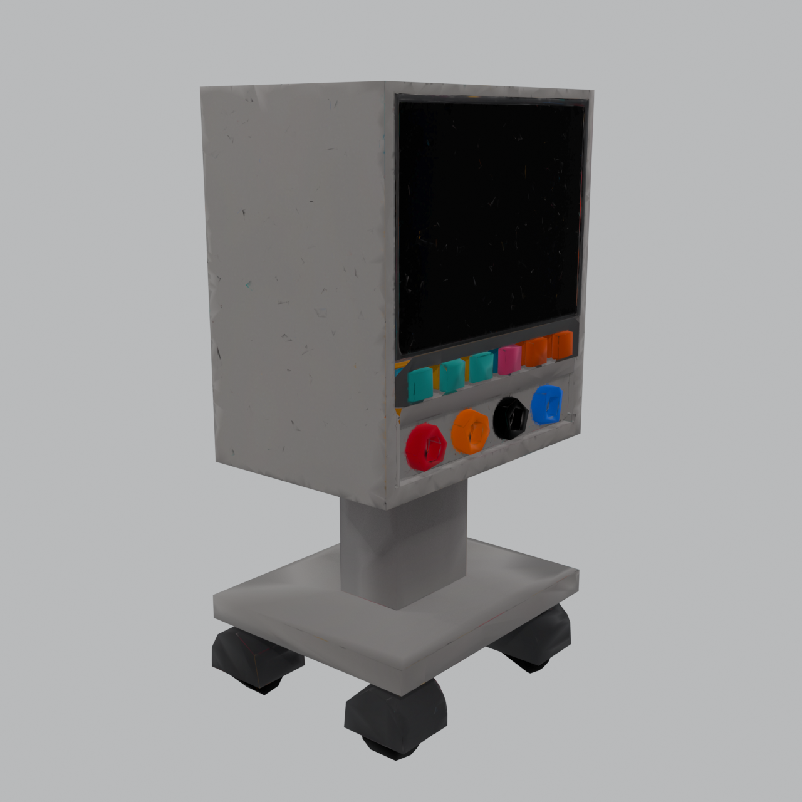
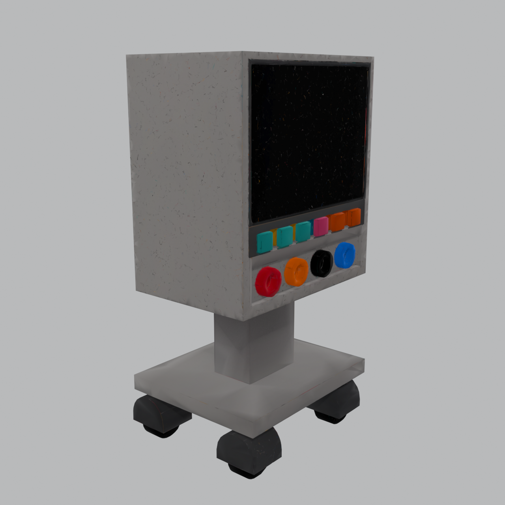
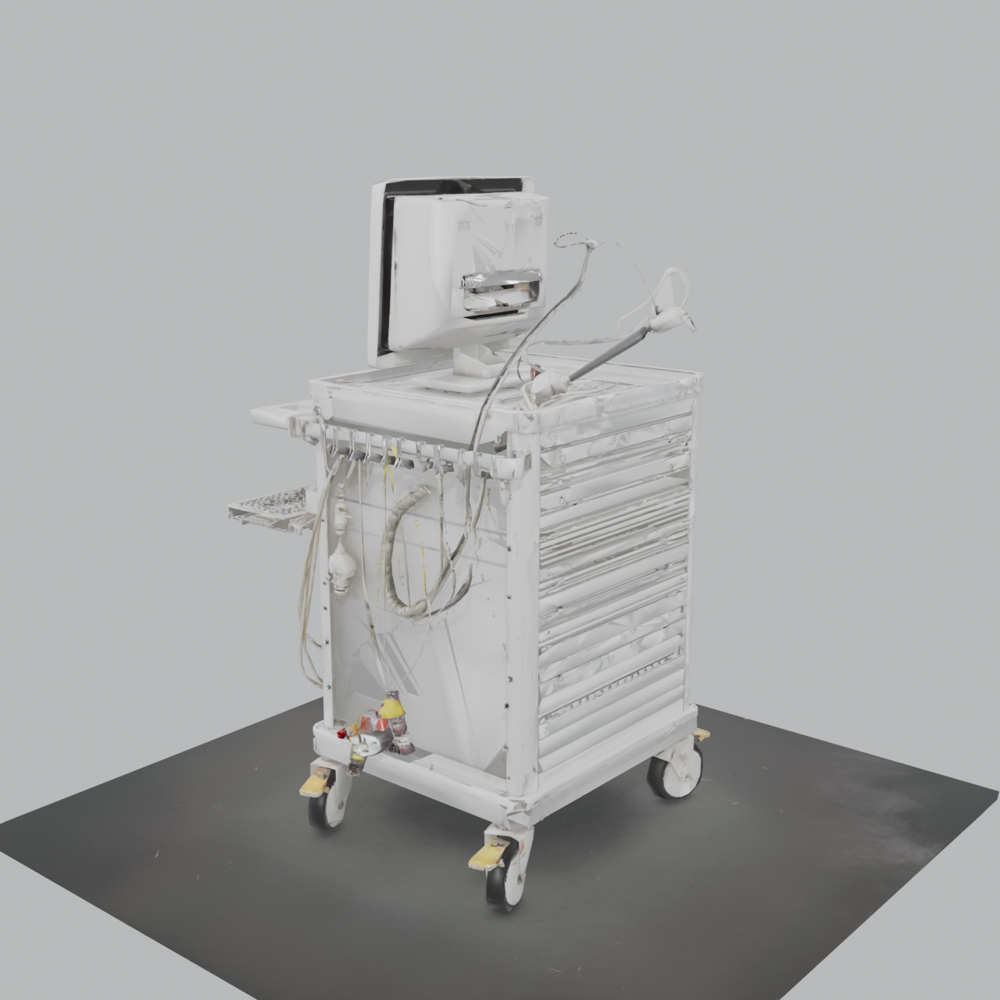

# ECG cart cagematch · treatments tried

Date: 2026-08-31 (G1 land 2026-09-01)  
Plan: [`ecg-cart-4view-optimize-cagematch-plan-2026-08-31.md`](./ecg-cart-4view-optimize-cagematch-plan-2026-08-31.md)  
Freeze: `tools/openclinxr/asset-pipeline/trellis/ecg-cart-c0-c1-control.json`  
Camera (every graded still): Blender EEVEE studio, 1280², three-quarter right, `elevDeg=14`, `azimDeg=40`, `radius=1.7912647724151611`, center `[-0.00834202766418457, -1.1920928955078125e-07, 0.015874087810516357]`. Do not AABB-refit.  
claimScope: same-subject Lane C bake-off on one ECG cart.  
notEvidenceFor: Quest readiness, clinical accuracy, hatch remesh, Blender `--bake` (not run).

Factory stills were **not** replaced. They stay on C1 vs C0 (`9ac738c0` website pair). M1 was **not** re-scored after G1.

---

## Shared knobs

| Knob | Value |
|---|---|
| Subject | `ecg-cart` |
| Control high (frozen raw) | 973,639 tris · SHA `6be8dfda…c65a` · `…/glb-grade-staging/2026-08-11T01-57-18Z/ecg-cart.glb` |
| Control low (C0) | 34,443 tris · SHA `c2b8c81f…359b9` · `…/champion.glb` |
| Renderer | `BLENDER_EEVEE` via `tools/openclinxr/factory/equipment-lane/render-glb-multiview-pack.py` |
| Grade still size | 1280×1280 PNG |
| Preferred budget | ≤ 80,000 tris |
| Lane C verdicts | `beats_control` \| `loses_to_control` \| `indistinguishable` \| `inconclusive_blocked` \| `other` |

---

## Sequence (ran)

| Seq | ID | What ran | Generation / pack | TRELLIS export | Decimate | Tris (graded) | Verdict vs C0 | Still |
|---:|---|---|---|---|---|---:|---|---|
| 0 | Imagine | Appearance oracle (not a mesh) | Grok Imagine hard-surface pack | — | — | — | likeness target | [01-imagine-image.png](../assets/factory-pipeline/01-imagine-image.png) |
| 1 | Control high | Factory pre-opt raw | prior TRELLIS bake (viewCount **unknown**) | remesh off (inferred from 973k) | none | 973,639 | control high | [02-preopt-mesh.png](../assets/factory-pipeline/02-preopt-mesh.png) |
| 2 | **C0** | Factory post-opt stretch (control low) | same raw as seq 1 | none | meshopt high-error stretch ~25k → **34,443 floor** | 34,443 | **control** | [c0-champion.png](../../tools/openclinxr/asset-pipeline/trellis/ecg-cart-c1-c0-renders/c0-champion.png) |
| 3 | **C1** | Same-source chain density falsifier | same raw as seq 1 | none | chain / r0_005 rung already on disk | 59,187 | **beats_control** (jacks circular vs C0 lumps) | [c1-r0_005.png](../../tools/openclinxr/asset-pipeline/trellis/ecg-cart-c1-c0-renders/c1-r0_005.png) |
| 4 | **M1** | Direct 80k from frozen C0 raw (plan T1) | same raw as seq 1 | none | `iterate-optimize` iter1 `direct_high_error` **preferred80k**, no weld | 79,999 | **beats_control** vs C0; **not** a Factory replace vs C1 | [m1-direct80k.png](../../tools/openclinxr/asset-pipeline/trellis/ecg-cart-m1-renders/m1-direct80k.png) |
| 5 | viewCount | GPU-free bake-measure read | frozen raw SHA `6be8dfda…` | — | — | 973,639 | `viewCount=null`, `missingBakeMeasure=true` (G1 eligible) | no still |
| 6 | **G1a** | 4-view bake, 16M export cap | PACK_A 4×1024 PNG, seed **237802**, `--no-remesh` | `--decimation-target 16777216` | n/a | extract **11,419,508** faces | **exit 137** (UV OOM). No GLB, no still | — |
| 7 | **G1b** | Same bake, 1M export, then preferred80k | same PACK_A + seed + remesh off | `--decimation-target 1000000` | iter1 preferred80k; meshopt **plateau ~153k** | graded **153,439** (raw 979,299) | **loses_to_control** (photoreal cluttered cart, wrong object class) | [g1-direct80k.png](../../tools/openclinxr/asset-pipeline/trellis/ecg-cart-g1-renders/g1-direct80k.png) |

---

## Parameter detail

### Seq 0 — Imagine oracle

| | |
|---|---|
| Path | `docs/assets/factory-pipeline/01-imagine-image.png` |
| Pack sheet | `docs/assets/factory-pipeline/01b-multiview-pack.png` |
| Role | likeness target for all grades |

### Seq 1–2 — Factory pair / C0

| | Control high | C0 low |
|---|---|---|
| File | `ecg-cart.glb` | `champion.glb` |
| Tris | 973,639 | 34,443 |
| SHA-256 | `6be8dfda2428742d252971a59b679b0466aa44d99b9f1f20a343e0d16e45c65a` | `c2b8c81fc661581a2ffa9173588b79c4937d09f2d5463f6224261e3cdf4359b9` |
| Opt | none | meshopt stretch (25k target → 34,443 floor) |
| Factory still | [02-preopt-mesh.png](../assets/factory-pipeline/02-preopt-mesh.png) (1,425,666 B) | [03-postopt-mesh.png](../assets/factory-pipeline/03-postopt-mesh.png) (1,355,200 B) |
| Cagematch still | — | [c0-champion.png](../../tools/openclinxr/asset-pipeline/trellis/ecg-cart-c1-c0-renders/c0-champion.png) |
| Bothy | — | parent Idle `tsk_df0b9db03e0e9afc` |

### Seq 3 — C1

| | |
|---|---|
| GLB | `ecg-cart-r0_005.glb` · 59,187 · SHA `c6f8e748a9d9783b16f814aae1d1e509a521f0145bb620a32110741ae8f71436` |
| Method | existing chain rung; no new TRELLIS |
| Report | `tools/openclinxr/asset-pipeline/trellis/ecg-cart-c1-c0-report.json` |
| Verdict | `beats_control` vs C0 (circular jacks, flatter pads) |
| Still | `tools/openclinxr/asset-pipeline/trellis/ecg-cart-c1-c0-renders/c1-r0_005.png` |
| Land | `tsk_ddac264a23ad361f` · `68355c1b` |

### Seq 4 — M1

| | |
|---|---|
| Input | frozen C0 raw 973,639 (`6be8dfda…`) |
| CLI | `pnpm exec tsx tools/openclinxr/asset-pipeline/trellis/iterate-optimize.ts --input <raw> --out <dir>` |
| Technique | iter1 `direct_high_error` **preferred80k**, weld **off** |
| Graded tris | 79,999 · SHA `8f004f610a8b42a76baf3edc7a17be1086266e6c82d8bb4b31b2e184877500c9` |
| Report | `tools/openclinxr/asset-pipeline/trellis/ecg-cart-m1-80k-report.json` |
| Verdict | `beats_control` vs C0; not a clear win vs C1 → Factory stays C1 |
| Still | `tools/openclinxr/asset-pipeline/trellis/ecg-cart-m1-renders/m1-direct80k.png` |
| Land | `tsk_26d81dc7d667c574` · `ac9c6e34` |

### Seq 5 — viewCount (instrument)

| | |
|---|---|
| Input | frozen raw SHA `6be8dfda…` |
| Method | GPU-free: adjacent `bake-measure.json` or evidence SHA match |
| Result | `viewCount=null`, `missingBakeMeasure=true` |
| Report | `tools/openclinxr/asset-pipeline/trellis/ecg-cart-raw-viewcount-report.json` |
| Still | none |
| Land | `tsk_e65b885da7940425` · `31ccb118` |

### Seq 6–7 — G1

PACK_A (issue-232 4-view, copied to `.openclinxr/evidence/ecg-cart-4view-cagematch/pack-a/ecg-cart/`; gitignored):

| View | SHA-256 |
|---|---|
| `front.png` | `447cf984ef498c502ab0dcab202054f0df9982842ae34fd50d3845289711afe3` |
| `side.png` | `d82774363ec40397de60d941b157e1a766de19eaaa0a50901e1c025b040a86da` |
| `three_quarter_left.png` | `cce078dcc89ba8d1d8f9ade71dae0902f660b9d1cccf6fead950854ed4b7a2e0` |
| `three_quarter_right.png` | `f635bf175effb22fcd7cb50be000f807bcba62526b173e964b9c17f12e9f67d7` |

| | G1a (failed export) | G1b (graded) |
|---|---|---|
| Subject | `ecg-cart` | same |
| Seed | **237802** (`237000 + crc32("ecg-cart") % 1000`) | same |
| Remesh | `--no-remesh` | same |
| Sampler | vendor balanced 12 / 7.5 (no knob overrides) | same |
| `--decimation-target` | 16,777,216 | **1,000,000** (retry after 137) |
| Extract faces | 11,419,508 | 11,419,508 |
| Export | killed, exit **137** during xatlas | 979,299 tris, 49,702,540 B, `viewCount=4` |
| meshopt | not run | iter1 preferred80k → **153,439** plateau (all ≤120k targets ~153k; champion policy 179,996) |
| `budgetPreferred80k` | — | **false** |
| Verdict | no still | **`loses_to_control`** |
| Report | — | `tools/openclinxr/asset-pipeline/trellis/ecg-cart-g1-report.json` |
| Still | — | `tools/openclinxr/asset-pipeline/trellis/ecg-cart-g1-renders/g1-direct80k.png` (1,514,967 B) |
| Land | — | `tsk_a3b0fcf3a56cb4b9` · `63c62297` |

G1b SHA: raw `5ac24389…c76534`, graded `88c784f9…b326c3`.

---

## Not run (Codex six-row remainder)

| ID | Intended | Why it did not run |
|---|---|---|
| **G2** | Same PACK_A+seed, remesh `project=0` + 300k export, then direct 80k | G1b on this pack lost on **object class**. Re-running remesh on the same PACK_A would bake the same photoreal cart. Hatch `--remesh` is 1-view CLI, not PACK_A. |
| **B1** | Cycles `--bake --bake-res 512` onto a winning 80k vs unbaked sibling | No winning 80k vs C1. Object-global cage rim class is known. |

Cut from the bake-off before start: weld-80k, interior-strip, remesh `project=1`, half-cage, component filter, pre-remesh bake. Midband 974,864 / viewCount 4 was **not** substituted for the frozen 973,639 SHA.

---

## Scoreboard (graded stills only)

| ID | Tris | vs C0 | vs Imagine class | Factory replace? |
|---|---:|---|---|---|
| C0 | 34,443 | control | same boxy cart; lumpy jacks | current post-opt still |
| C1 | 59,187 | beats_control | same boxy cart; circular jacks | **yes (stills stay here)** |
| M1 | 79,999 | beats_control | same boxy cart; circular jacks; not a clear win vs C1 | no |
| G1b | 153,439 | loses_to_control | different object (cables/drawers/probe/CRT) | no |

Vision grades on G1 (native 1280): parent; `01a05acc-ce66-71d3-9a4b-27b40f55cd73` (`deepseek-v4-flash-vision-exp`); `01a05ad2-e35d-78e0-93dd-0fa597cb2e57` (`grok-4.6`). All `loses_to_control`.
