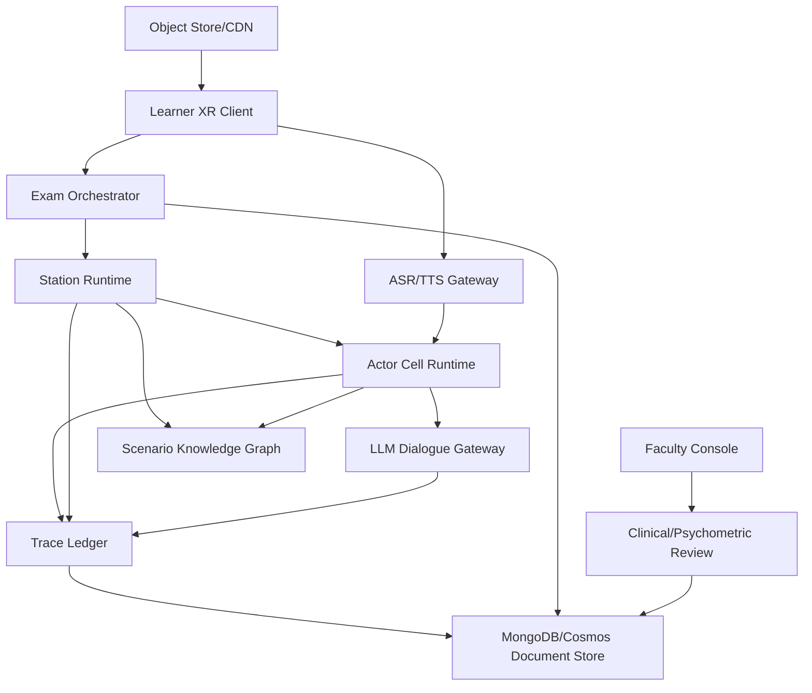
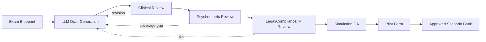

# OpenClinXR Exam Scenario Architecture

Date: 2026-05-03
Status: Development-readiness architecture draft

## Architecture Goal

OpenClinXR must support generation, review, assembly, administration, tracing, replay, and psychometric analysis of a multi-station XR clinical skills exam. A learner should progress through a fixed sequence of timed stations, each with realistic environments, multiple actors, multimodal interaction, and post-station documentation.

## Core Concepts

### Exam Blueprint

An exam blueprint defines the intended assessment coverage before scenarios are selected.

It includes:

- Exam purpose: practice, formative assessment, validation pilot, or local programmatic assessment.
- Station count.
- Station duration.
- Note duration.
- Break cadence.
- Required environments.
- Specialty distribution.
- EPA and AMA day-one skill coverage.
- Difficulty mix.
- Required actor types.
- Required safety-critical events.
- Scoring facets.
- Randomization constraints.

### Exam Form

An exam form is a concrete sequence of stations selected from the scenario bank.

It includes:

- Ordered station IDs.
- Station versions.
- Break slots and transition timing.
- Actor versions.
- Environment versions.
- LLM model and prompt policy versions.
- Scoring rubric versions.
- Psychometric review status.
- Publication status.

### Station

A station is one timed clinical encounter plus a post-encounter task.

Each station includes:

- Doorway instructions.
- Environment scene.
- Actor roster.
- Hidden clinical truth.
- Learner task list.
- Event schedule.
- Permitted tools.
- Expected history/physical/documentation/oral-summary elements.
- Safety-critical actions.
- Scoring rubric.
- Termination rules.

### Actor

An actor can be a virtual patient, family member, nurse, consultant, attending, interpreter, respiratory therapist, social worker, or bystander.

Each actor has:

- Role.
- Goal.
- Knowledge boundaries.
- Disclosure rules.
- Voice profile.
- Emotional baseline.
- Pain model.
- Memory stream.
- Reaction policy.
- Allowed actions.
- Safety guardrails.

### Environment

An environment is a spatial context with clinical affordances.

Examples:

- ED bay.
- Inpatient ward.
- Outpatient clinic.
- ICU room.
- Pediatrics room.
- Telehealth/phone station.
- Waiting room or hallway handoff.

Each environment defines:

- 3D scene assets.
- Usable objects.
- Monitors and vitals displays.
- Ambient sound.
- Interruption sources.
- Privacy constraints.
- Movement boundaries.
- Accessibility variants.

## Runtime Architecture

## Actor Cell Model

OpenClinXR should use an actor-cell design even if CellixJS is not selected as the runtime dependency.

Actor cells:

- `ExamSessionCell`: controls station order, timing, accommodations, breaks, and terminal state.
- `StationCell`: controls doorway, encounter, note, scoring, and transition phases.
- `EnvironmentCell`: controls scene state, vitals, alarms, object affordances, and environmental events.
- `PatientActorCell`: controls patient memory, symptoms, pain, emotions, history disclosure, and responses.
- `FamilyActorCell`: controls family pressure, emotional escalation, questions, and consent/conflict behavior.
- `NurseActorCell`: controls interruptions, team prompts, vitals updates, task requests, and escalation cues.
- `EvaluatorCell`: observes trace events, checks completeness, and prepares human-review packets.
- `SafetyGuardrailCell`: blocks unsafe dialogue or exam-invalid actions and escalates to faculty review.

Cells communicate by immutable messages:

- `LearnerSpeechObserved`
- `LearnerActionObserved`
- `ActorResponseRequested`
- `ActorResponseGenerated`
- `VitalsChanged`
- `EnvironmentEventTriggered`
- `SafetyCriticalActionObserved`
- `StationTimerExpired`
- `PatientNoteSubmitted`
- `FacultyScoreSubmitted`

## LLM Control Plane

LLMs are used in four different modes with separate permissions.

### Scenario Generator

Generates candidate station specifications from blueprint constraints. Output is never exam-ready until reviewed.

Inputs:

- Blueprint.
- Specialty constraints.
- EPA targets.
- Environment templates.
- Psychometric coverage gaps.
- Source constraints.

Outputs:

- Draft station.
- Actor cards.
- Hidden truth.
- Rubric draft.
- Expected trace events.
- Risk flags.

### Actor Dialogue Engine

Generates bounded actor responses during a station.

Inputs:

- Actor card.
- Station state.
- Retrieved memories.
- Learner utterance/action.
- Safety policy.
- Disclosure rules.

Outputs:

- Text response.
- Speech synthesis instruction.
- Emotion delta.
- Gesture/action cue.
- Trace explanation.

### Reflection And Consistency Engine

Runs outside the hot path or at low frequency to maintain actor consistency.

Outputs:

- Memory summaries.
- Contradiction flags.
- Emotional arc updates.
- Case-drift warnings.

### Review Assistant

Supports clinical and psychometric reviewers by surfacing coverage, contradictions, and risky generated content. It does not approve content by itself.

## Scenario Bank Lifecycle

## Development Boundaries

The next code phase should build:

- Blueprint editor.
- Scenario bank data model.
- Exam form assembler.
- Station runtime skeleton.
- Actor card and memory model.
- Trace ledger.
- Human review workflow.

The first full-fidelity exam form should support a 12-station configuration with 15-minute encounter windows, 10-minute patient-note windows, and configurable breaks after stations 3, 6, and 9. The MVP may execute a smaller subset, but the data model and runtime state machine should already support the full sequence.

The next code phase should not build:

- High-stakes autonomous scoring.
- Public marketplace.
- EHR integration.
- Real-patient data ingestion.
- Production-level XR asset pipeline.
