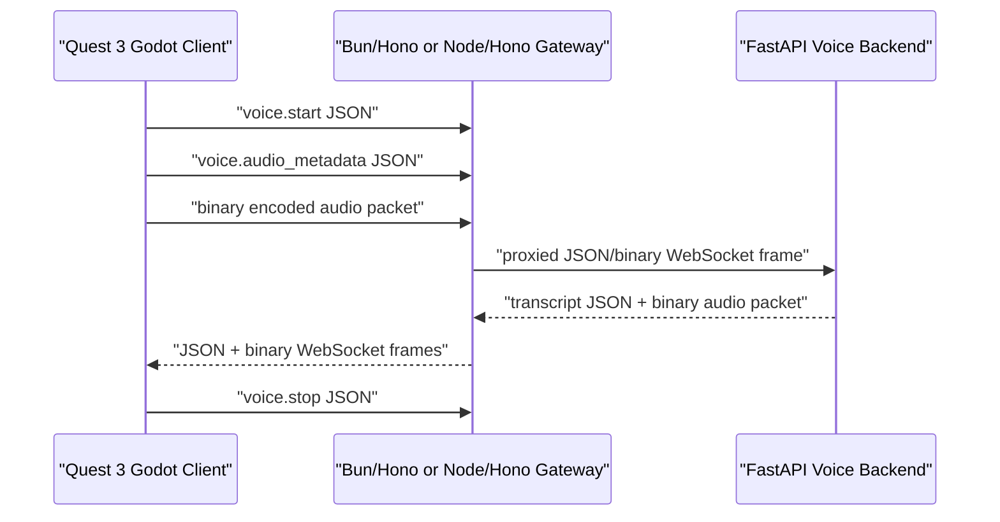

# Godot Quest Voice Client Spike

Date: 2026-05-04

## Status

`apps/ui-quest-voice-godot` is a source-level Godot 4 sidecar for the realtime
voice transport contract. It is intentionally outside the default runtime path
and does not add package dependencies.

## Contract

## Evidence Boundary

This sidecar validates code shape only:

- Godot `WebSocketPeer` is the client transport.
- Binary packets use `put_packet`.
- JSON control frames use `send_text`.
- `voice.audio_metadata` carries chunk index, byte length, codec, and client timestamp before each binary packet.
- The endpoint is `/voice/realtime/ws`.
- The future codec lane is `opus` at 48 kHz.

It does not prove:

- Quest microphone capture.
- Native Opus encode/decode.
- Audio playback.
- Real Moshi/Qwen/Grok inference.
- End-to-end latency on the headset.

## Next Evidence Steps

1. Install or locate Godot 4 locally and run a syntax/import check.
2. Add a Quest-compatible native Opus codec path or deliberately switch this
   lane to WebRTC if that proves simpler.
3. Connect to the local gateway and record first binary frame round-trip from
   the Quest.
4. Add capture/playback timestamps and report p50/p95 end-to-end latency.
