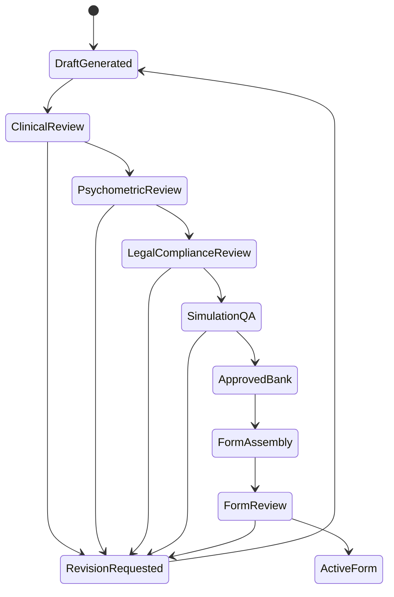

# Psychometric And Review Governance

Date: 2026-05-03
Status: Development handoff draft

## Score-Use Boundary

OpenClinXR scores are formative or local-programmatic by default. The system must not present learner outputs as licensure-ready, board-equivalent, ECFMG-equivalent, USMLE-equivalent, or high-stakes decisions unless a later validation program supports that specific score use.

## Scenario Review Gates

Scenario status progression:



Required reviewers:

- Specialty clinician.
- Simulation educator.
- Psychometrician.
- Legal/compliance reviewer.
- Simulation QA reviewer.

## Blueprint Evidence Matrix

Each exam form must include a generated and reviewable matrix:

| Station | Specialty | Environment | History/Exam | Urgent Recognition | Teamwork | Oral Summary | Documentation | Communication | Time/Prioritization |
| --- | --- | --- | --- | --- | --- | --- | --- | --- | --- |
| 1 | Emergency medicine | ED bay | Primary | Primary | Primary | Optional | Primary | Primary | Primary |
| 2 | Internal medicine | Ward | Primary | Secondary | Primary | Primary | Primary | Secondary | Primary |
| 3 | Pediatrics | Clinic | Primary | Secondary | Secondary | Optional | Primary | Primary | Secondary |

The system should block exam-form activation when blueprint-required coverage is missing.

## Rater Training Minimum

Before a station produces learner-facing rubric feedback, the system should store:

- Rater guide.
- Anchor examples for high, medium, and low performance.
- Common error list.
- Evidence examples mapped to trace categories.
- Calibration packet.
- Rater agreement target.
- Adjudication workflow.

## Trace-Quality Metric

Trace quality is not validity evidence by itself, but poor trace quality invalidates later evidence.

Initial trace-quality score:

```text
trace_quality =
  0.30 * required_event_capture_rate +
  0.20 * safety_critical_event_capture_rate +
  0.15 * timer_transition_integrity +
  0.15 * actor_attribution_confidence +
  0.10 * audit_completeness +
  0.10 * replay_reconstructability
```

Minimum deterministic milestone:

- Required event capture: at least 95 percent.
- Safety-critical capture: 100 percent.
- Timer transition integrity: 100 percent.
- Actor attribution confidence: at least 90 percent for scripted text runs.
- Audit completeness: 100 percent for all generated or fixture actor responses.
- Replay reconstructability: station can be reviewed from trace without live runtime state.

## Validation Roadmap

Stage 0: Content and workflow review.

- Clinician review.
- Psychometrician review.
- Legal/compliance review.
- Simulation QA.

Stage 1: Internal deterministic dry run.

- Synthetic learner traces.
- Trace-quality checks.
- Reviewer workflow usability.

Stage 2: Small faculty/learner usability study.

- Cognitive walkthrough.
- Debrief usefulness.
- Workflow timing.
- Actor realism feedback.

Stage 3: Rater calibration pilot.

- Multiple raters score same traces.
- Agreement estimates.
- Rubric refinement.

Stage 4: Generalizability and fairness pilot.

- Station, rater, learner, and environment facets.
- Bias and accessibility review.
- Consequence review.

Stage 5: Expanded score-use argument.

- Only after evidence supports the proposed use.

## Human Review Packet Requirements

Each station review packet must include:

- Source and version provenance.
- Doorway instructions.
- Hidden truth visible only to reviewers.
- Actor cards and disclosure rules.
- Timeline replay.
- Required trace events and observed evidence.
- Safety-critical events.
- Patient note.
- LLM audit log if used.
- Rubric and anchor descriptions.
- Reviewer comments.
- Final score-use label.
