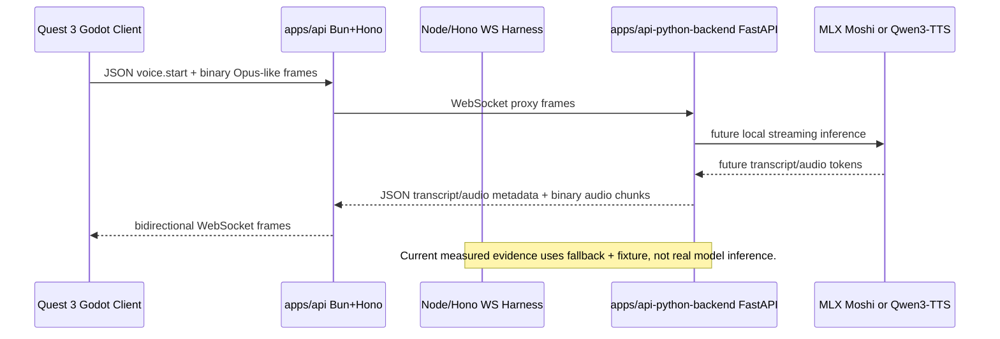

# Realtime Voice Transport Spike

Date: 2026-05-04

## Recommendation

Use WebSocket-first for the immediate Quest 3 voice path, with `/apps/api` treated as the Bun + Hono primary API target and Node/Hono as the local fallback until Bun is installed and benchmarked on this machine. Keep WebTransport and direct QUIC as protocol slots, not production claims, until the runtime and headset path are measured end to end.

## Implemented Local Evidence

- `apps/api` exposes protocol posture at `GET /runtime/protocols`.
- `apps/api` also exposes realtime voice gateway posture at `GET /voice/realtime/posture`, using the shared `@openclinxr/voice-gateway` contract while keeping runtime availability conservative.
- `apps/api/src/bun-server.ts` is the Bun + Hono entrypoint; `pnpm --filter @openclinxr/api dev:bun` is available when Bun is installed.
- `apps/mock-realtime-voice-server` provides the verified Node/Hono/WebSocket fallback harness.
- `apps/api-python-backend` provides a FastAPI/Uvicorn source skeleton with stdlib-only verification.
- `docs/openclinxr/realtime-voice-transport-spike-2026-05-04.json` records a no-cloud bidirectional streaming harness run.
- `docs/openclinxr/api-python-backend-runtime-smoke-2026-05-04.json` is now linked into the realtime report, retiring the stale FastAPI-not-executed blocker while preserving model, Quest audio, Opus, and safety blockers.
- The report now records protocol evidence separately: WebSocket local harness observed; Bun/Hono runtime, WebTransport, direct QUIC, and Web3 signaling remain unobserved and evidence-gated.
- The Godot Quest client source contract is observed in `apps/ui-quest-voice-godot`: dependency-free Godot sidecar, `WebSocketPeer`, `voice.audio_metadata`, and opaque binary packets. Godot runtime execution on this machine and Quest microphone/playback evidence are still unobserved.
- Godot and the local gateway contract send `voice.audio_metadata` before binary chunks so chunk indexes and per-frame latency samples can be measured before native Opus and real model integration.

## Sequence



## Godot Client Sketch

```gdscript
extends Node

var socket := WebSocketPeer.new()
var target_url := "ws://127.0.0.1:4017/voice/realtime/ws"

func _ready() -> void:
    var error := socket.connect_to_url(target_url)
    if error != OK:
        push_error("voice websocket connect failed: %s" % error)

func _process(_delta: float) -> void:
    socket.poll()
    if socket.get_ready_state() == WebSocketPeer.STATE_OPEN:
        while socket.get_available_packet_count() > 0:
            var packet := socket.get_packet()
            if socket.was_string_packet():
                print(packet.get_string_from_utf8())
            else:
                _play_received_audio_packet(packet)

func start_voice_session() -> void:
    socket.send_text(JSON.stringify({
        "type": "voice.start",
        "codec": "opus",
        "sampleRateHz": 48000
    }))

func send_opus_packet(packet: PackedByteArray) -> void:
    socket.send_text(JSON.stringify({
        "type": "voice.audio_metadata",
        "chunkIndex": 0,
        "byteLength": packet.size(),
        "codec": "opus",
        "clientSentAtMs": Time.get_ticks_msec()
    }))
    socket.put_packet(packet)

func stop_voice_session() -> void:
    socket.send_text(JSON.stringify({ "type": "voice.stop" }))

func _play_received_audio_packet(_packet: PackedByteArray) -> void:
    # Placeholder: Quest-ready Opus decode/playback needs a native codec layer
    # or a different transport such as WebRTC before this becomes production evidence.
    pass
```

## Source Posture

- Bun WebSockets and Hono WebSocket helpers support the WebSocket-first target, but Bun HTTP/3/WebTransport is not verified here: [Bun WebSockets](https://bun.sh/docs/runtime/http/websockets), [Hono WebSocket helper](https://hono.dev/docs/helpers/websocket), [Bun WebTransport issue](https://github.com/oven-sh/bun/issues/13656).
- Godot `WebSocketPeer` supports RFC 6455 and binary frames through `put_packet`, but Quest-ready Opus encode/decode is not turnkey in this repo: [Godot WebSocketPeer](https://docs.godotengine.org/en/stable/classes/class_websocketpeer.html), [Godot AudioEffectCapture](https://docs.godotengine.org/en/stable/classes/class_audioeffectcapture.html).
- FastAPI/Uvicorn WebSockets are a good Python backend shape: [FastAPI WebSockets](https://fastapi.tiangolo.com/advanced/websockets/), [Uvicorn WebSockets](https://www.uvicorn.org/concepts/websockets/).
- Moshi MLX is the stronger full-duplex dialogue candidate; Qwen3-TTS is stronger as a streaming TTS candidate: [Moshi repo](https://github.com/kyutai-labs/moshi), [Moshi paper](https://arxiv.org/abs/2410.00037), [Qwen3-TTS repo](https://github.com/QwenLM/Qwen3-TTS), [Qwen3-TTS paper](https://arxiv.org/abs/2601.15621).

## Remaining Blockers

- Install or attach a Godot runtime for source-level sidecar execution.
- Execute a real Quest/Godot client with microphone capture and playback.
- Add or select a native Opus encode/decode path for Quest/Godot, or switch this lane to WebRTC if that proves simpler.
- Install Bun locally and benchmark `/apps/api` Bun/Hono WebSocket behavior.
- Approve or reject the QUIC/Web3 protocol posture proposal before adding direct QUIC, WebTransport polyfill/gateway, or Web3 identity/signaling dependencies.
- Install and benchmark Moshi MLX or Qwen3-TTS on the target Apple Silicon machine.
- Add synthetic voice disclosure, retention, misuse, and clinical-safety controls to the real model stream.
