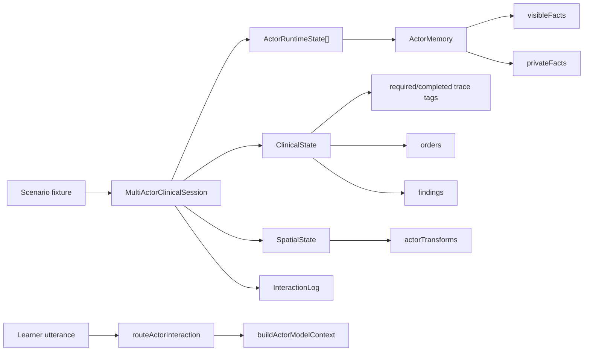
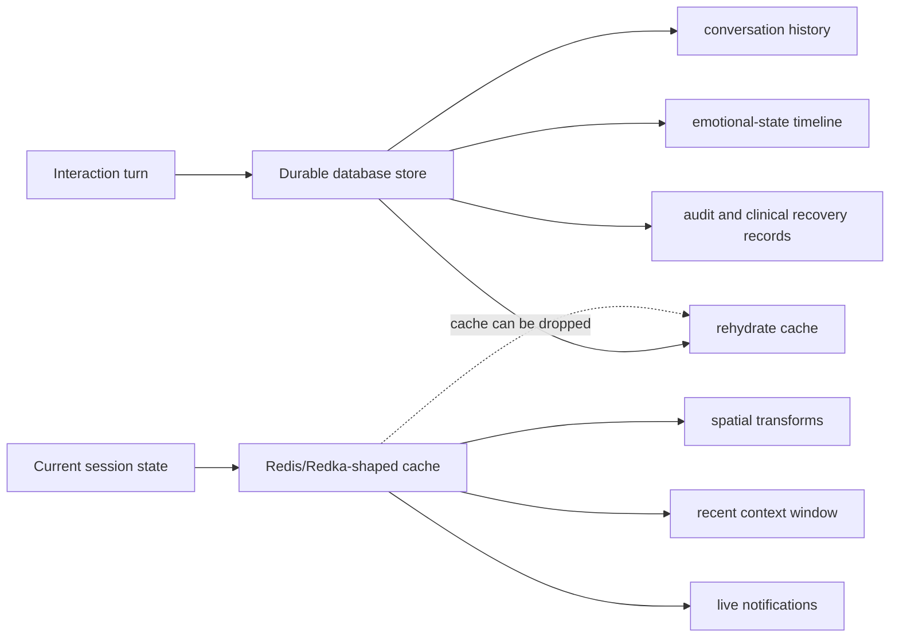

# Server-Side Multi-Actor State Spike

**Date:** 2026-05-05  
**Proposal:** `proposals/approved/proposal-server-side-multi-actor-state-context.md`  
**Status:** First implementation-backed spike complete  
**Scope:** Server-side architecture spike only. This is not a production architecture decision.

## Executive Recommendation

Use a custom domain-state baseline first, then promote the stable API surface into `packages/openclinxr/scenario-runtime` through a follow-up proposal after more evidence exists.

Do not install Colyseus, `@colyseus/schema`, or bitECS into production paths yet. The first bottleneck is not networking framework capability; it is defining the clinical domain contract precisely enough that actor memory, routing, trace tags, spatial state, and future voice turns cannot drift apart.

## Implemented Spike Artifact

The spike artifact lives at:

- `packages/openclinxr/multi-actor-state-spike`

It validates a no-new-runtime-dependency model for:

- Distinct actors with role, display name, demeanor, private memory, visible memory, emotional state, and relationship to learner.
- Addressed routing by actor name or role keyword, with patient fallback.
- Per-actor context building for future model prompts without leaking one actor's private memory into another actor's context.
- Structured clinical state for required trace tags, completed trace tags, orders, and findings.
- Spatial actor transforms with interaction state, position, rotation, and last update time.
- Typed interaction-turn provenance for text and final voice-transcript inputs, including stream id, transcript segment id, provider id, trace tags, and evidence references.
- Phase 2 persistence contracts separating durable conversation/emotional-state records from disposable Redis/Redka-shaped realtime cache snapshots.
- Explicit evidence boundaries so the spike is not mistaken for Quest sync, LLM quality, production runtime, or clinical validity proof.

## State Model



## Dependency Evaluation

Observed package metadata was checked on 2026-05-05 with local `pnpm view` commands.

| Option | Observed Version | License Posture | Fit | Recommendation |
| --- | ---: | --- | --- | --- |
| Custom domain state | Internal | No new runtime dependency | Best first fit for Bun/Hono and Azure-compatible API boundaries | Recommended first |
| Colyseus | 0.17.10 | MIT package metadata | Mature realtime room/state framework, but high transitive and runtime surface for the first domain contract | Install-backed follow-up candidate |
| `@colyseus/schema` | 4.0.21 | MIT package metadata | Lighter schema/delta candidate if custom state needs binary/delta sync later | Defer until need is proven |
| bitECS | 0.4.0 | MPL-2.0 package metadata; license-gated | ECS modeling aligns conceptually with spatial actors, but does not solve server replication alone | Defer until license accepted or replaced |

bitECS remains blocked by project license posture until the license inconsistency is resolved or explicitly accepted. The relevant upstream issue is: https://github.com/NateTheGreatt/bitECS/issues/212

## Voice Turn Posture

Voice runtime is not merged into server state. That is intentional.

The spike now accepts final voice-transcript metadata as an interaction source, then routes the final transcript through the same actor-name and role-keyword logic as text. The interaction log stores stream id, transcript segment id, final transcript text, provider id, trace tags, and provenance refs. It records `rawAudioStored: false` so the state model stores references and traceability, not raw audio blobs.

This keeps voice transport and inference concerns outside actor state. The current realtime voice spike separately tracks local Moshi/Qwen candidates, the Python backend, and Bun/Hono WebSocket transport evidence. A future production proposal can connect those systems through typed interaction events without embedding transport runtime details directly into actor memory.

## Phase 2 Persistence Posture

The Phase 2 persistence spike is approved in `proposals/approved/proposal-server-side-multi-actor-state-context-persistence-phase2.md`.

The implemented spike keeps two contracts separate:

- Durable database source of truth: conversation history, emotional-state timeline, clinical trace events, orders/findings, audit-relevant interaction records, and recovery checkpoints.
- Redis/Redka-shaped realtime cache: actor transforms, presence, recent context window, pub/sub notifications, and short-lived session leases.

The spike uses an in-memory adapter test double rather than installing Redis, Redka, or Redis mocks. That is deliberate. The first question is whether the boundary is correct. Package/runtime compatibility can follow once the contract is stable.



The recovery test records a voice-transcript interaction turn, persists it to the durable store with `rawAudioStored: false`, writes a realtime cache snapshot, clears the cache, then rehydrates the realtime snapshot from durable state. This proves the intended responsibility split without claiming production persistence, Redis runtime performance, Redka package compatibility, or clinical record-retention readiness.

## Follow-Up Proposal Shape

A production-oriented follow-up should decide:

- Whether the custom state baseline moves into `packages/openclinxr/scenario-runtime` or a dedicated `packages/openclinxr/session-state`.
- Whether live synchronization stays custom over the existing Bun/Hono WebSocket lane or adopts `@colyseus/schema` for schema/delta encoding.
- Whether Colyseus is useful only as a mock/load sidecar, not the main Azure Functions-compatible API runtime.
- How to represent high-frequency spatial updates separately from slower clinical state events.
- How voice turn ids, transcript segments, actor routing, and trace ledger entries are stitched without leaking hidden actor memory.

## Estimated Effort

| Follow-Up Slice | Estimate | Notes |
| --- | ---: | --- |
| Promote baseline into production-shaped package | 0.5-1 day | Mostly move/rename plus ArchUnitTS boundaries and API exports |
| Add WebSocket session-state messages to `apps/api` | 1-2 days | Keep WebSocket primary; no HTTP/3/WebTransport scope |
| Connect voice turn references to runtime events | 1-2 days | Depends on realtime voice backend evidence maturity |
| Add MongoDB-backed durable adapter for Phase 2 persistence | 1-2 days | Use thin `data-mongodb` style and `mongodb-memory-server` tests |
| Evaluate Redka/Redis package/runtime compatibility | 0.5-1 day | Only after adapter contract stabilizes; no package needed for first pass |
| Evaluate `@colyseus/schema` with custom state | 0.5-1 day | Sidecar only until need is proven |
| Colyseus sidecar room prototype | 1-2 days | Useful if rooms/presence/matchmaking become requirements |

## Verification

Initial verification commands for this slice:

```bash
pnpm --filter @openclinxr/multi-actor-state-spike test
pnpm --filter @openclinxr/multi-actor-state-spike typecheck
```

Both commands passed during the first implementation run on 2026-05-05, after the voice-transcript provenance slice, and after the Phase 2 persistence-boundary slice.
