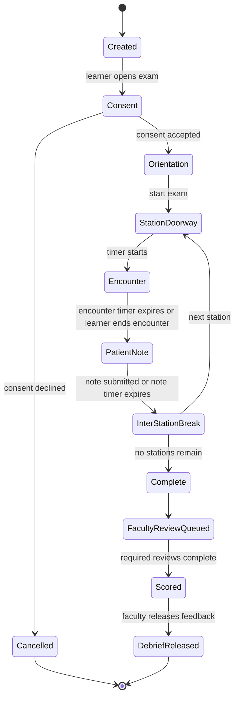
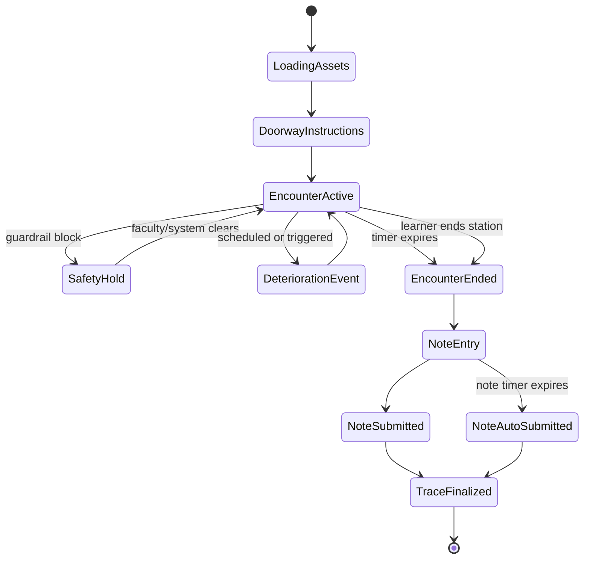
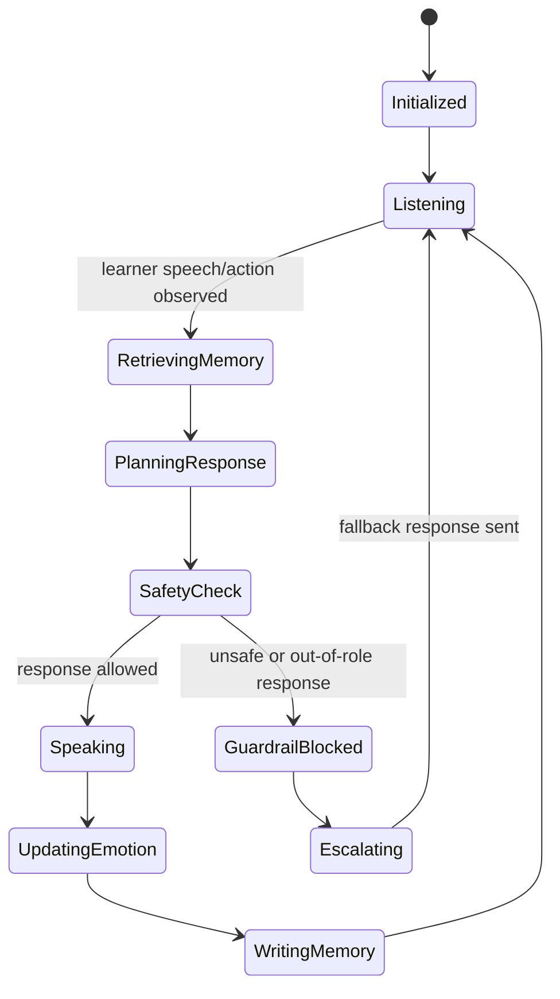
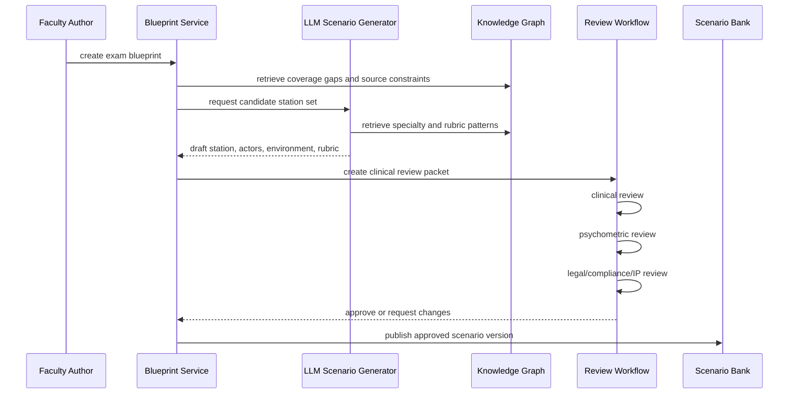
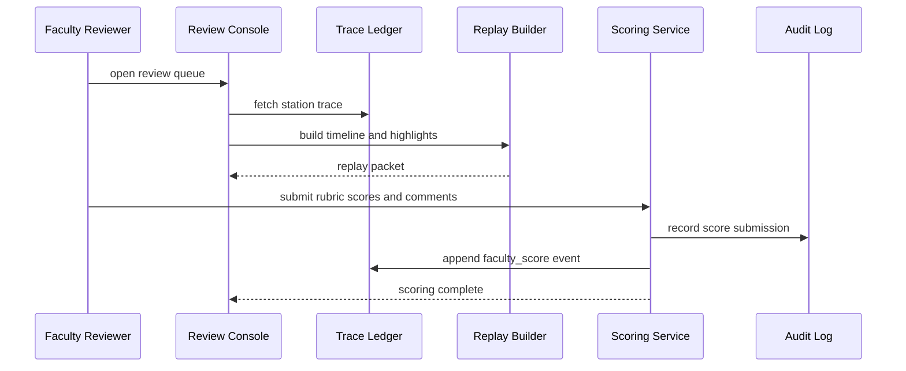
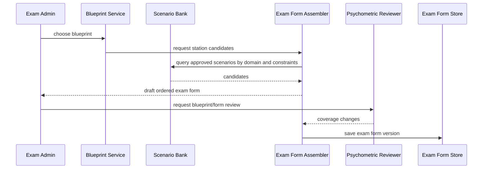

# Statecharts And Sequences

Date: 2026-05-03
Status: Development-readiness draft

## Exam Session Statechart



## Station Runtime Statechart



## Actor Cell Statechart



## Scenario Generation And Review Sequence



## Live Encounter Sequence

```mermaid
sequenceDiagram
  participant Learner as Learner XR Client
  participant Station as Station Runtime
  participant Actor as Actor Cell
  participant Memory as Actor Memory Retriever
  participant LLM as LLM Dialogue Gateway
  participant Speech as ASR/TTS Gateway
  participant Trace as Trace Ledger

  Learner->>Speech: speech audio stream
  Speech-->>Station: transcript and confidence
  Station->>Trace: record learner_speech
  Station->>Actor: LearnerSpeechObserved
  Actor->>Memory: retrieve relevant memories
  Memory-->>Actor: memories ranked by relevance, recency, importance
  Actor->>LLM: bounded response request
  LLM-->>Actor: response, emotion delta, gesture cue
  Actor->>Trace: record llm_audit and actor_response
  Actor->>Speech: synthesize response
  Speech-->>Learner: audio response
  Actor-->>Station: actor state update
  Station-->>Learner: avatar and environment update
```

## Faculty Review Sequence



## Exam Assembly Sequence



