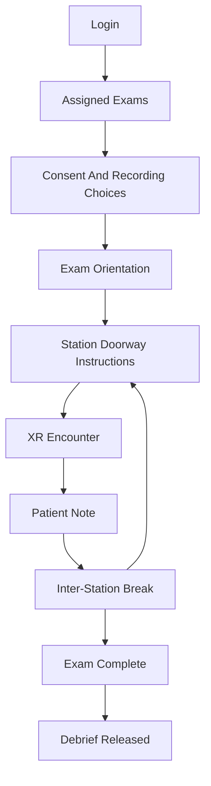
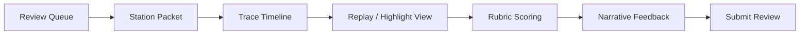
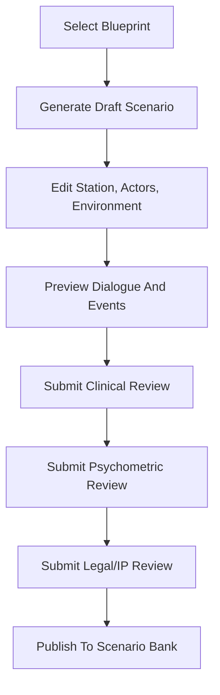
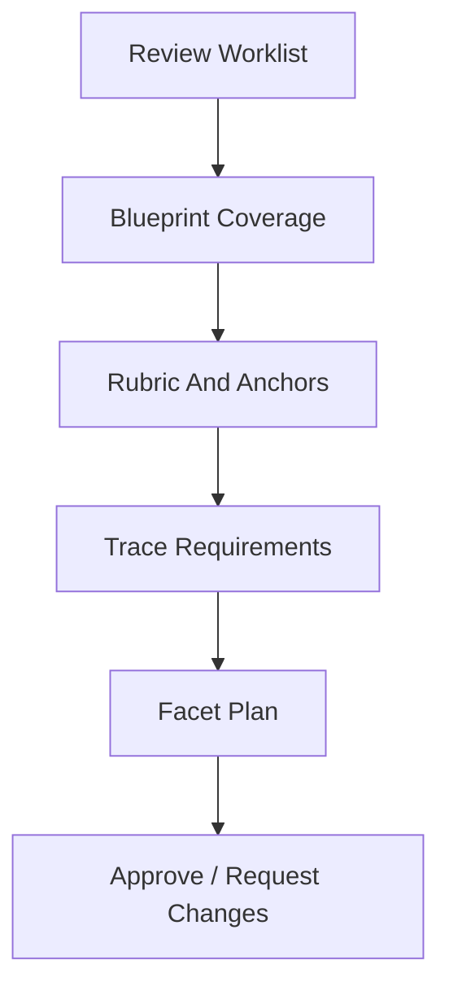
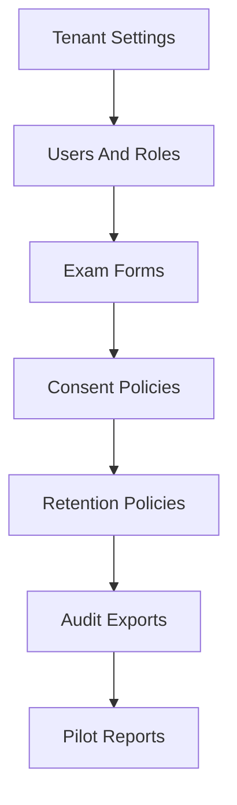

# UX Flows

Date: 2026-05-03
Status: Development-readiness draft

## Roles

- Learner.
- Faculty reviewer.
- Scenario author.
- Psychometric reviewer.
- Clinical reviewer.
- Institution admin.
- Researcher.

## Learner Exam Flow



Learner screen requirements:

- Countdown timer.
- Station instructions.
- Accessibility controls.
- Device readiness indicator.
- Voice capture status.
- Note editor after encounter.
- Clear station transition cues.

## Faculty Review Flow



Faculty screen requirements:

- Review queue by learner, station, urgency, and completion status.
- Timeline grouped by history, exam, team, urgent action, documentation, and communication.
- Highlight flags for safety-critical actions and missed required events.
- Human scoring form with behavioral anchors.
- Rater calibration reminder.

## Scenario Author Flow



Authoring screen requirements:

- Blueprint coverage panel.
- LLM draft generation with source constraints.
- Actor card editor.
- Hidden clinical truth editor.
- Environment event schedule.
- Rubric editor.
- Review status dashboard.

## Psychometric Reviewer Flow



Psychometric screen requirements:

- Domain coverage matrix.
- Station-to-EPA and station-to-AMA skill mapping.
- Rater sampling plan.
- Case/rater/site/device/model-version facet plan.
- Fairness review prompts.

## Admin Flow



Admin screen requirements:

- Role assignment.
- Exam-form publication.
- Consent and retention policy configuration.
- Data export approvals.
- Audit log search.
- Pilot KPI dashboard.

## Exam Builder Wireframe

```text
+--------------------------------------------------------------------------------+
| OpenClinXR Exam Builder                                      Blueprint: UME CS  |
+----------------------+---------------------------------------------------------+
| Coverage             | Station Sequence                                        |
| - History/Physical   | 1. ED Chest Pain - ED Bay - 15m + 10m note             |
| - Oral Summary       | 2. Goals of Care - Inpatient Room - 15m + 10m note     |
| - Documentation      | 3. Pediatric Fever - Clinic Room - 15m + 10m note      |
| - Teamwork           |                                                         |
| - Urgent Care        | [Add From Bank] [Generate Candidate] [Run Coverage QA] |
+----------------------+---------------------------------------------------------+
| Selected Station                                                               |
| Doorway Instructions                                                           |
| Actors: Patient, Nurse, Family Member                                          |
| Environment: ED Bay                                                            |
| Required Events: ECG request, escalation, oral summary, documentation          |
| Review Status: Clinical pending | Psychometric pending | Legal pending         |
+--------------------------------------------------------------------------------+
```

## Faculty Review Wireframe

```text
+--------------------------------------------------------------------------------+
| Review Queue                          Learner: L-104 | Station 1 ED Chest Pain |
+----------------------+---------------------------------------------------------+
| Timeline             | Replay / Transcript                                    |
| 00:20 Intro          | Learner: Can you tell me what brought you in?         |
| 01:15 Pain details   | Patient: My chest feels tight...                     |
| 04:40 Nurse interrupt| Nurse: Doctor, his blood pressure is dropping.       |
| 07:20 ECG requested  | System: Safety-critical action observed.             |
+----------------------+---------------------------------------------------------+
| Rubric                                                                         |
| History/Physical [  ]  Oral Summary [  ]  Documentation [  ] Teamwork [  ]     |
| Urgent Care [  ]  Organizing Work [  ]                                         |
| Comments                                                                        |
| [............................................................................] |
| [Save Draft] [Submit Review]                                                    |
+--------------------------------------------------------------------------------+
```

