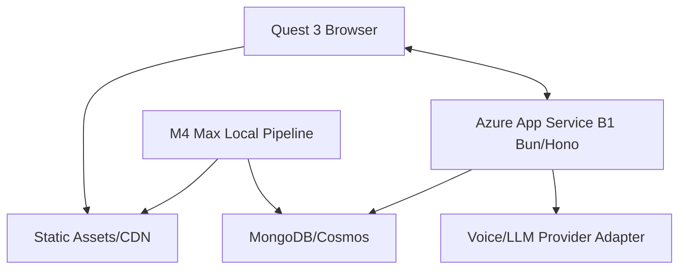

# WebXR, Azure, And Quest 3 Performance Brief

Date: 2026-05-03
Status: Development-team guidance

## Performance Goal

The first OpenClinXR implementation should feel stable and non-jittery on Quest 3 for one active learner. Realism comes from authored station design, responsive actor behavior, speech timing, gaze, and clear clinical affordances, not from running heavy generative workloads on the headset or on Azure B1.

Minimum target:

- 72 FPS during active WebXR.
- No missed station timer transitions.
- Under 250 ms local interaction acknowledgment for gaze/hand/tool events.
- Under 1.5 s perceived first actor response for deterministic text/fixture response.
- Under 2.5 s first audio for cloud voice response in the first pilot, with a lower target after provider benchmarking.

Stretch target:

- 90 FPS in core stations.
- Under 1.0 s perceived first audio for the selected production voice path.

## Azure B1 Role

Azure App Service Plan B1 should be treated as a single-user orchestration tier:

- REST API.
- Auth/session validation.
- Scenario/state loading.
- WebSocket control stream.
- Trace batching.
- Review workflow.
- Provider calls to external LLM/voice services.

B1 should not run:

- Realtime 3D generation.
- Blender.
- ComfyUI.
- StableGen.
- Audio2Face compute.
- Local LLM inference.
- Heavy ASR/TTS.
- High-frequency analytics.

If B1 becomes unstable, upgrade vertically before optimizing prematurely. The architecture should allow B2/Premium or containerized workers without changing station domain code.

## Local M4 Max Mode

The M4 Max MacBook Pro with 64 GB RAM can run the entire single-user development path:

- Bun/Hono API.
- MongoDB local or Docker.
- WebXR dev server.
- Asset pipeline.
- Blender/gltf-transform.
- Local LLM adapter with llama.cpp, Ollama, or MLX-compatible tooling.
- Local test harness.

Use local mode to benchmark:

- Voice latency without Azure network overhead.
- LLM response time for deterministic actor policy tests.
- Asset load and frame stability.
- Offline demo readiness.

## Transport Strategy

### Initial Runtime

Use WebSocket first.

Reasons:

- xAI realtime voice APIs use WebSocket.
- Bun has mature WebSocket support.
- Azure App Service supports WebSocket deployment paths more predictably than full WebTransport/HTTP3 end to end.
- The first system is single-user.
- Trace and animation control messages are small.

### WebTransport Spike

Keep WebTransport behind a `RealtimeTransport` interface:

```ts
export interface RealtimeTransport {
  connect(sessionId: string, token: string): Promise<void>;
  send(event: ClientRealtimeEvent): Promise<void>;
  onMessage(handler: (event: ServerRealtimeEvent) => void): void;
  close(code?: number, reason?: string): Promise<void>;
}
```

Spike WebTransport only after:

- Quest 3 browser support is confirmed on the exact headset/browser version.
- TLS and HTTP/3 proxy chain is confirmed.
- Azure or alternative edge path supports the required protocol path.
- WebSocket performance is measured and found insufficient.

WebTransport remains attractive because MDN marks it Baseline 2026 and it supports multiple streams and datagrams. It is not a guaranteed B1 deployment feature.

## Quest 3 Runtime Budget

Initial station budget:

| Budget | Target |
| --- | ---: |
| Active avatars | 1 hero + 2 supporting |
| Visible triangles | 180k max, 120k preferred |
| Draw calls | 120 max, 80 preferred |
| Texture memory | 512 MB max visible |
| Station bundle | 80 MB max compressed, 50 MB preferred |
| Hero character texture | 2K max |
| Supporting actor texture | 1K max |
| Prop textures | 512-1K atlas |
| Dynamic lights | 0-1; prefer baked |
| Physics | Interaction colliders only |
| Live cloth/hair physics | Off |
| Runtime generated body animation | Off |

These budgets are planning targets, not validated guarantees. Every station must be tested on device.

## Rendering Strategy

Use:

- Forward rendering.
- Baked lighting and lightmaps.
- KTX2 compressed textures.
- Meshopt-compressed geometry.
- Frustum culling.
- LOD switching.
- Instancing for repeated props.
- Shared materials and texture atlases.
- Low-poly collision proxies.
- Object pooling for runtime markers and trace debug overlays.

Avoid:

- Per-frame allocations.
- Rebuilding geometries or materials during station runtime.
- Unbounded particle systems.
- Real-time global illumination.
- Multiple transparent hair/curtain layers.
- Live cloth simulation.
- Large DOM overlays in immersive mode.

## In-XR Text And Data

Use HTML-in-canvas style surfaces for:

- Doorway instructions.
- Case notes.
- Simulated EHR.
- Vitals panels.
- Medication list.
- Orders/results.
- Patient note entry.

Implementation options:

- Render React/HTML panel to an offscreen canvas texture.
- Use crisp SDF text for critical labels.
- Use a non-XR browser fallback for long-form note entry if headset typing becomes too slow.
- Keep EHR panels large, high-contrast, and fixed to a stable physical plane.

Text panel rules:

- Minimum readable type size in headset.
- No dense tables beyond what can be comfortably scanned.
- Stable layout; no content shifts during speech.
- Vitals and alarms use large text plus color and shape indicators.
- Always provide non-color cues for abnormal results.

## Actor Realism Without Jitter

Runtime actor realism should use layered lightweight systems:

- Pre-baked body clips.
- Gaze target interpolation.
- Head turn interpolation.
- Facial blendshape/viseme clips.
- Emotion intensity values mapped to animation weights.
- Voice-driven mouth animation only if latency and frame timing pass.
- Nurse/family entrances and interruptions as scheduled clips.

Do not run full body gesture generation on headset. Generate or choose gesture clips offline, then select/blend them at runtime.

## Latency Budget

Suggested measurement events:

| Event | Budget | Trace name |
| --- | ---: | --- |
| Learner speech start detected | 100 ms | `speech_start_detected` |
| Partial transcript visible | 500 ms | `stt_partial_received` |
| Intent classified | 250 ms after transcript | `intent_classified` |
| Actor fixture response selected | 100 ms | `actor_fixture_selected` |
| LLM response first token | 1500 ms initial target | `llm_first_token` |
| TTS first audio chunk | 2500 ms initial target | `tts_first_audio` |
| Avatar starts response gesture | 100 ms after response selected | `animation_started` |
| Trace event persisted | 1000 ms batched | `trace_persisted` |

## Testing Strategy

Automated:

- Unit tests for station statecharts.
- Contract tests for transport adapters.
- Simulated learner traces for every case.
- Storybook tests for admin components.
- Serenity/JS tests for scenario authoring, review, publish, exam start, station complete, faculty review.
- Playwright browser tests for non-XR fallback and WebGL smoke checks.
- Synthetic performance checks for asset bundle size, triangle counts, draw calls, and texture sizes.

Manual/device:

- Quest 3 smoke test for every station bundle.
- Headset FPS and thermal/jitter observation.
- Controller and hand-tracking interaction check.
- In-XR text readability check.
- Audio interruption and turn-taking check.

The manual Quest 3 pass should be required before a station is marked simulation-QA approved.

## Deployment Shape

Single-user pilot:



Scale path:

1. B1 single-user.
2. B2/B3 with separate Mongo and storage.
3. Premium App Service or container apps for more concurrent sessions.
4. Separate workers for analytics and asset processing.
5. Edge/CDN and provider routing for multi-region delivery.

## Sources

- `src-internal-openclinxr-architecture-bundle`
- `src-azure-app-service-plan-docs-2026`
- `src-mdn-webtransport-2026`
- `src-mdn-webxr-performance-2026`
- `src-xai-voice-api-docs-2026`
- `src-llama-cpp-github-2026`
- `src-npm-stack-metadata-2026-05-03`
