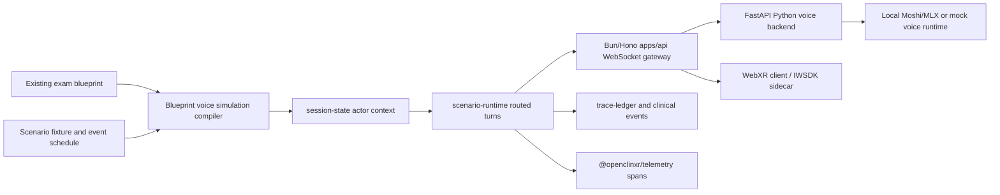

# Proposal: Blueprint-Driven Multi-Agent Voice Simulation Spike

**Status:** Approved  
**Approved by:** Patrick Gidich on 2026-05-05 20:23 EDT, with Codex revisions approved in-thread  
**Owner:** Patrick Gidich / OpenClinXR team  
**Date:** 2026-05-05  
**Scope:** Local-first spike only; no production runtime adoption

## Decision

Approve a constrained local-first spike to prove whether OpenClinXR can consume the existing case bank and exam blueprint, instantiate the actors required by a selected station, and run a multi-character voice interaction loop through the current Bun/Hono plus Python-backend architecture.

The spike is allowed to evaluate Pipecat and Pipecat Flows as orchestration candidates, but the source of truth must remain OpenClinXR's existing TypeScript domain contracts: `@openclinxr/scenario-fixtures`, `@openclinxr/exam-assembly`, `@openclinxr/session-state`, `@openclinxr/scenario-runtime`, `@openclinxr/voice-gateway`, and `@openclinxr/telemetry`.

## Review Revisions

The submitted draft was directionally useful. These revisions tighten it for the current repository:

- Replace "no assumptions on data format" with explicit integration against the existing OpenClinXR scenario bank and Step 2 CS-style seed blueprint.
- Treat "natural full-duplex voice" as an evidence target, not an upfront claim. Real voice readiness must be measured on local hardware.
- Keep Pipecat as a candidate orchestration adapter, not the owner of clinical state, privacy rules, or blueprint interpretation.
- Separate workstation local-audio proof from Quest/WebXR proof. The first spike may use local audio loopback or workstation microphone/speaker; Quest microphone/playback and in-headset latency need separate evidence.
- Use `@openclinxr/telemetry` span vocabulary first. OpenTelemetry exporters may be wired later, but traces must not carry raw prompt text, learner utterances, hidden facts, patient notes, or raw audio.
- Keep IWSDK in the approved sidecar lane until bundle, MCP/devtool, and physical Quest evidence mature.

## Goal And Hypothesis

Goal: deliver a minimal, fully local prototype on Apple Silicon that loads an existing OpenClinXR station, constructs the station's actors and voice-turn policy, exercises blueprint-defined triggers, and emits structured traces/evidence for review. The baseline hardware target is the current local Mac workstation; M1 Max evidence is acceptable as a conservative baseline, while M4 Pro/Max evidence should be recorded separately when available.

Hypothesis: the existing blueprint, scenario, session-state, voice-gateway, and telemetry contracts are already close enough to support a blueprint-driven multi-agent voice simulation without changing the case-bank schema or adopting a new realtime state framework. Local full-duplex speech remains the riskiest part and should be measured behind the existing Python sidecar.

## Success Tiers

| Tier | Required Evidence | Meaning |
| --- | --- | --- |
| Tier 0: blueprint compiler | Existing `ed_chest_pain_priority_v1` or another approved scenario compiles into actor prompts, voice slots, trigger rules, privacy rules, and trace expectations | Proves case-bank integration without voice claims |
| Tier 1: local mock voice loop | Bun/Hono and Python backend exchange bidirectional voice protocol frames while scenario-runtime records routed actor turns and clinical traces | Proves architecture path with deterministic local substitutes |
| Tier 2: real local inference | Approved local Moshi MLX or equivalent produces measured local speech events with startup, first-response, interruption, lag, and memory evidence | Proves local inference feasibility on Apple Silicon, not Quest readiness |
| Tier 3: WebXR/IWSDK client proof | IWSDK sidecar or production XR client streams/receives audio and records visual/audio evidence | Proves WebXR integration posture, still not production clinical readiness |

The spike should aim for Tier 1 first and only claim higher tiers when evidence exists.

## In Scope

- Use the existing scenario bank and Step 2 CS-style seed blueprint as the source of truth.
- Select one existing station, initially `ed_chest_pain_priority_v1` unless another existing scenario has better multi-character dialogue triggers.
- Dynamically instantiate Patient, Family Member, Nurse, Physician, or other actors only when present in the selected scenario.
- Compile actor traits from existing fields such as demeanor, role, visible memory, hidden facts, emotional state, and event schedule. If richer traits such as snarky, timid, outgoing, scared, angry, or happy are not present in the selected case, the spike may map only what exists and report the gap.
- Support timed and event-driven triggers already represented by OpenClinXR scenario events and trace tags.
- Demonstrate multi-character dialogue when the selected scenario supports it, including learner interruption or learner-directed routing through session-state.
- Evaluate pre-warming of agent plans, voice runtime handles, prompt/context bundles, and first-response caches, while keeping default dev startup free of model downloads or heavyweight inference.
- Use local WebSocket transport through `apps/api` and `apps/api-python-backend`.
- Emit structured interaction evidence using `@openclinxr/telemetry` span names and low-cardinality attributes.
- Use local workstation audio for early tests; WebXR/IWSDK integration may be a later tier inside `apps/ui-xr-iwsdk-spike`.
- Document the upgrade path from local mock/local models to production-provider facades such as Grok Voice or Grok reasoning models.
- If the spike introduces or revises MongoDB persistence, repository indexes, replay queries, or search/AI retrieval, consult the installed MongoDB Agent Skills from `mongodb/agent-skills` first. This does not authorize Atlas/cloud services or new MongoDB packages by itself.

## Out Of Scope

- Changing the scenario-bank, blueprint, shared-schema, or case-authoring data format as part of the spike.
- Production deployment, summative scoring, clinical validity claims, or Step 2 CS equivalence claims.
- Adding new roles that are not in the selected existing scenario.
- Wiring Pipecat, Colyseus, bitECS, Redka, or Redis into production runtime packages.
- Adding cloud providers, paid APIs, hosted transports, hosted STT/TTS, or externally routed media.
- Committing model weights, generated private audio, raw transcripts containing sensitive learner content, local venvs, or cache directories.
- Promoting IWSDK from sidecar to production runtime.

## Recommended Architecture

The recommended path is hybrid:

- TypeScript owns clinical state, blueprint compilation, routing, trace tags, guardrails, and evidence.
- Python owns local voice runtime integration because MLX/Moshi/Qwen-style audio tooling is Python-native.
- Pipecat is evaluated as an optional Python orchestration adapter, especially for audio pipeline composition and structured flows.
- Bun/Hono remains the single external gateway for local and future production topology.

## Candidate Stack

| Layer | Preferred Spike Posture | Notes |
| --- | --- | --- |
| Blueprint source | Existing OpenClinXR scenario bank and `createStep2CsStyleSeedBlueprint()` | No schema changes |
| Clinical state | `@openclinxr/session-state` and `@openclinxr/scenario-runtime` | Actor memory and privacy boundaries stay here |
| Voice facade | `@openclinxr/voice-gateway` plus existing realtime protocol | Provider-neutral boundary |
| Gateway | `apps/api` Bun/Hono WebSocket lane | WebSocket is primary; HTTP/3/WebTransport remains separate evidence-gated work |
| Voice backend | `apps/api-python-backend` FastAPI sidecar | Local-only ML/audio integration point |
| Orchestration candidate | Pipecat / Pipecat Flows, pending exact-version and transitive license review | Candidate adapter, not the clinical source of truth |
| Voice model candidate | Previously approved Moshi MLX q4; Qwen3-TTS as outbound fallback | Use only under the local realtime voice approval boundaries |
| Observability | `@openclinxr/telemetry` first, OpenTelemetry exporter later | No PHI/high-cardinality fields in spans |
| Client | `apps/ui-xr-iwsdk-spike` first, production `apps/ui-xr` later only after evidence | Keep IWSDK sidecar-gated |

## Guardrails

- Hidden facts remain out of model prompts unless scenario rules explicitly allow disclosure after a trigger.
- Actor-visible memory and private memory must stay separated by `session-state` helpers.
- Personality and emotion are instructions for acting style, not permission to break clinical facts, privacy boundaries, or safety rules.
- Learner interruption should route through deterministic actor-selection logic before any model/voice call.
- All traces and telemetry must use stable identifiers, not raw prompt, transcript, patient-note, hidden-fact, or raw-audio payloads.
- Generated audio evidence must be local-only and either synthetic/non-sensitive or stored outside the repo with hashes/provenance only.

## Spike Activities

1. Build a read-only blueprint-to-voice-plan compiler for one existing scenario. It should emit actor roster, voice slots, trigger plan, trace tags, privacy constraints, prewarm plan, and expected evidence fields.
2. Add deterministic tests proving the compiler uses the existing scenario/blueprint and does not invent roles or traits.
3. Connect the plan to `scenario-runtime` routed actor responses using mock voice events first.
4. Add local Python backend endpoints or WebSocket messages for prewarm, start, interrupt, stop, and evidence summary, while preserving the existing realtime voice protocol.
5. If a local full-duplex model is already installed under the approved cache, run a measured local inference pass. If not, report `not_configured` instead of failing.
6. Optionally evaluate Pipecat/Pipecat Flows in an isolated Python spike path after exact packages, versions, licenses, and provider plugins are reviewed.
7. Capture evidence JSON with latency, startup/prewarm cost, first response, interruption behavior, actor consistency, trigger firing, privacy guardrail outcomes, and telemetry summary.
8. Document upgrade paths for production provider swaps: local Moshi/Qwen/VibeVoice dev modes, Grok Voice/Grok LLM production candidates, and facade boundaries.

## Acceptance Criteria

- Evidence identifies the selected scenario and blueprint slot from existing OpenClinXR data.
- Actor roster, role, demeanor/emotion mapping, visible memory, hidden-fact policy, and trigger list are generated from existing fixtures.
- No new role, case, or blueprint field is required to complete Tier 0 or Tier 1.
- A learner utterance can route to a specific actor and produce a traceable final voice-transcript turn without storing raw audio.
- A timed or event-driven trigger fires and records a trace or clinical event.
- If multi-character dialogue is tested, the learner can interrupt and the routing/evidence distinguishes agent-to-agent dialogue from learner-directed dialogue.
- Prewarm evidence records what was loaded, when it was loaded, memory/latency cost, and whether it improved first response.
- Telemetry summary uses only approved low-cardinality OpenClinXR attributes.
- Any real local model run records cloud APIs used `false`, paid APIs used `false`, model/cache paths outside repo, runtime versions, and caveats.
- The output clearly states whether it reached Tier 0, Tier 1, Tier 2, or Tier 3.

## Operator Approval Boundaries

Codex may:

- Add proposal/docs and package-local planning contracts for the spike.
- Add deterministic tests around blueprint-to-voice-plan compilation.
- Reuse already approved local-only voice runtime evidence and cache locations.
- Run local mock transport/backend smokes and commit evidence after verification.
- Evaluate Pipecat as a candidate in documentation or an isolated spike path after exact package review.

Codex must not, without a new install/runtime proposal or an already applicable approval:

- Add Pipecat, Pipecat Flows, Colyseus, bitECS, Redis/Redka, new ML packages, or new WebXR dependencies to workspace manifests.
- Download new model weights or provider SDKs outside the already approved local voice/model scopes.
- Use Grok, OpenAI, hosted STT/TTS, cloud relays, paid APIs, or hosted media services.
- Wire the spike into production routes, production persistence, production IWSDK runtime, or learner-facing assessment flows.
- Claim Quest, production, clinical validity, exam equivalence, or low-latency readiness without corresponding evidence.

## Risks And Mitigations

| Risk | Mitigation |
| --- | --- |
| Local full-duplex speech is too slow on M1 Max | Tier the spike; record lag and first-response metrics rather than blocking blueprint integration |
| Pipecat examples assume cloud STT/TTS/LLM providers | Keep provider plugins disabled unless local-only and license-reviewed |
| Actor style instructions leak hidden facts | Use session-state actor context helpers and adversarial guardrail probes |
| Prewarming hides unacceptable runtime cost | Record memory, startup time, warm-run improvement, and cleanup behavior |
| WebXR audio path differs from workstation audio | Treat workstation audio and Quest/IWSDK audio as separate evidence tiers |
| Telemetry accidentally stores sensitive content | Reuse `safeTelemetryAttributes` and record raw transcript/audio references only in durable clinical trace stores when separately approved |

## Initial Output Files

The follow-up implementation plan should prefer narrow additions such as:

- `tools/openclinxr/blueprint-voice-simulation-spike.ts`
- `tools/openclinxr/blueprint-voice-simulation-spike.test.ts`
- `docs/openclinxr/blueprint-voice-simulation-spike-YYYY-MM-DD.json`
- Optional Python-only spike modules under `apps/api-python-backend`, gated by local runtime configuration.

## Rollback

Remove the spike docs, tests, and package-local helpers. No production routes, cloud resources, model weights, database migrations, or learner-facing behavior are created by this proposal.

## Sources

- Pipecat introduction: https://docs.pipecat.ai/overview/introduction
- Pipecat Flows guide: https://docs.pipecat.ai/guides/features/pipecat-flows
- Pipecat GitHub organization license posture: https://github.com/pipecat-ai
- Existing local realtime voice approval: `proposals/approved/proposal-local-realtime-voice-model-inference.md`
- Existing IWSDK sidecar approval: `proposals/approved/proposal-iwsdk-sidecar-install.md`
- Existing protocol posture approval: `proposals/approved/proposal-quic-web3-protocol-posture.md`
